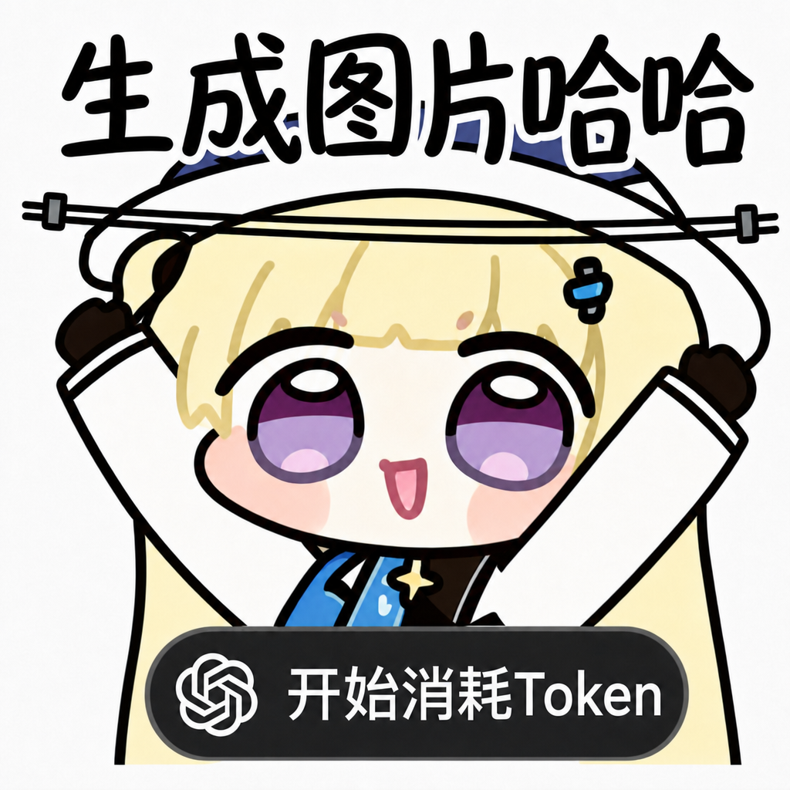

<p align="center">
  
</p>

# TokenCanvas

把提示词、参考图、mask 和 OpenAI 图片参数放进同一张本地创作画布。

TokenCanvas 是一个浏览器版个人图片工作台。它直接使用 OpenAI 和 AI SDK，适合在本地快速试验、保存历史、复用结果，并把一次次消耗的 Token 变成可继续迭代的创作上下文。

## 项目定位

TokenCanvas 解决的是“图片生成过程太零散”的问题：脚本、临时请求、下载文件和参数记录经常分开保存，下一轮想沿用上一次结果时，又要重新找 prompt、参考图和输出设置。

这个项目把创作链路收拢到一个本地页面里：

- 配置一次 OpenAI API key 和默认图片模型
- 在同一处管理 prompt、参考图、mask 和输出参数
- 生成后立即预览、下载、复用为下一轮参考图
- 用本地历史和预设保存常用创作上下文

## 适合的使用场景

- 个人在本地调用 OpenAI 图片模型做快速创作
- 比较同一 prompt 在不同尺寸、质量、背景和格式下的结果
- 使用一张或多张参考图继续生成新图
- 上传 mask 做轻量遮罩编辑
- 把近期结果沉淀成本地历史，方便继续改写和复用

## 不解决的问题

- 不托管团队 API key，也不提供账号系统或多人共享
- 不做第三方 OpenAI-compatible provider 兼容性调试
- 不内置画笔、图层、复杂修图或完整图片编辑器能力
- 不把聊天式多轮图片 agent 作为当前主流程

## 功能概览

| 能力 | 说明 |
| --- | --- |
| OpenAI 设置 | 在当前浏览器保存 API key、模型和默认参数 |
| 文生图 | 使用 AI SDK `generateImage()` 调用 OpenAI 图片模型 |
| 图生图 | 支持单张或多张参考图输入 |
| 遮罩编辑 | 支持上传 mask 文件 |
| 输出控制 | 支持 size、count、quality、background、output format、output compression |
| 结果复用 | 当前结果可预览、下载，并继续作为参考图 |
| 本地历史 | 保存近期生成记录，减少重复查找 |
| 预设模板 | 保存常用创作设置，快速回到熟悉参数 |
| 终端模式 | 使用 Ink TUI 或脚本命令从本地路径生成图片 |

## 本地启动

```bash
pnpm install
pnpm run dev
```

默认开发地址：

```text
http://127.0.0.1:5173
```

请通过 `pnpm run dev` 或 `pnpm run preview` 运行，不要直接双击 `index.html`。

## 终端模式

TokenCanvas 也提供独立的终端工作台。终端模式使用自己的配置和历史，不读取或写入浏览器 localStorage、IndexedDB、浏览器历史或预设。

启动交互式 TUI：

```bash
pnpm cli
```

TUI 启动后是类似 Claude Code / Codex CLI 的 slash-command 工作区。底部输入框支持输入 `/` 后联想指令，输入一部分后按 Tab 补全当前候选；候选列表会高亮匹配到的指令，并显示语法和用途。常用指令：

```text
/help                 查看全部指令和用法
/config               逐项配置 API key、baseURL、model、output
/apikey               输入或更新 OpenAI API key
/baseurl              输入或更新 OpenAI baseURL
/mode                 下拉选择 text、image、mask
/size                 下拉选择生成尺寸
/quality              下拉选择生成质量
/format               下拉选择输出格式
/background           下拉选择背景
/count                设置本次生成张数
/compression          设置 JPEG/WEBP 输出压缩
/prompt               输入提示词
/reference            输入参考图路径，多个路径用逗号分隔
/mask                 输入 mask 图片路径
/output               设置输出目录
/generate             开始生成，生成中会显示 loading
```

运行一次脚本友好的生成命令：

```bash
pnpm cli -- generate \
  --prompt "a cinematic product photo of a glass perfume bottle" \
  --output-dir ./tokencanvas-output
```

图生图和 mask 使用本地文件路径：

```bash
pnpm cli -- generate \
  --prompt "turn this sketch into a clean app icon" \
  --reference ./input/sketch.png \
  --mask ./input/mask.png \
  --output-dir ./tokencanvas-output \
  --json
```

终端模式默认把 API key、模型和默认参数保存到用户配置目录。可以用 `TOKENCANVAS_CONFIG_DIR` 指定隔离目录，适合测试或临时项目：

```bash
TOKENCANVAS_CONFIG_DIR=.tokencanvas-tmp pnpm cli
```

终端图片预览是渐进增强能力。支持的终端可以显示内联预览；不支持时生成仍然成功，命令会输出本地图片路径作为可靠结果。

## 使用路径

1. 打开页面后填写 OpenAI API key 和图片模型。
2. 输入正向提示词，按需要添加参考图或 mask。
3. 调整尺寸、张数、质量、背景和输出格式。
4. 点击生成，在结果区查看图片。
5. 下载满意结果，或把某张结果带回下一轮继续图生图。
6. 通过历史记录和预设回到之前的创作上下文。

## 数据与安全边界

TokenCanvas 当前按个人本地工具设计：

- OpenAI API key 只保存在当前浏览器本地
- 历史记录和预设也只保存在当前浏览器
- 终端模式的 API key、默认参数和最近历史保存在独立的终端配置目录
- 首发形态不提供服务端代理、云端同步或多人权限控制
- 如果要公开部署，应先补充后端代理和服务端密钥管理

## 常用命令

```bash
pnpm cli
pnpm cli -- generate --prompt "..." --output-dir ./tokencanvas-output
pnpm test
pnpm run typecheck:node
pnpm run build
pnpm run test:e2e
```

## 提交流程规范

本仓库默认使用下面这条交付闭环，不把“代码写完”当作完成：

1. 完成功能或修复后，先跑 `pnpm test`、`pnpm run typecheck:node`、`pnpm run build`。
2. 在开 PR 前执行一轮 `ce-code-review`，把阻塞问题修掉；如果 review 后还有代码改动，就继续复审，直到没有剩余阻塞问题。
3. 问题收口后，用 `ce-compound` 把这轮真实问题、根因、修复和验证沉淀到 `docs/solutions/`。
4. 然后再做 Git 交付：`commit -> push -> PR -> merge main -> delete feature branch`。

如果用户明确要求“提交到远端并合并到 main，再删当前功能分支”，默认按这个顺序直接执行，不额外拆成半截交付。

## 目录导览

```txt
src/app/               # 应用集成入口和主工作台状态
src/features/settings/ # OpenAI 设置面板
src/features/workbench/# prompt、参考图、mask 和生成控制
src/features/results/  # 当前结果、预览、下载和复用
src/features/history/  # 本地历史记录
src/features/presets/  # 本地预设模板
src/cli/               # 终端 TUI、直接生成命令、终端配置和历史
src/lib/openai/        # AI SDK 图片生成请求层
src/lib/storage/       # 本地持久化
```

## 设计取舍

- 创作体验优先于 API 调试体验：主界面围绕“下一张图怎么生成”组织。
- 本地优先：凭证、历史和预设默认留在当前浏览器。
- 终端隔离：CLI/TUI 使用独立配置和历史，避免污染浏览器工作台状态。
- 单一路径：主链路直接使用 OpenAI 和 AI SDK，不继续维护兼容 provider 分支。
- 结果可延续：生成结果不只是下载物，也可以成为下一轮创作素材。
- 错误要可恢复：失败时优先告诉用户该检查 key、模型、输入图片还是参数组合。

## 后续方向

- 后端 API route 代理和服务端密钥管理
- 内置 mask 绘制器
- Responses API 多轮图片工作流
- 更丰富的结果筛选与批量复用

## 协议

本项目基于 [MIT License](LICENSE) 开源。
