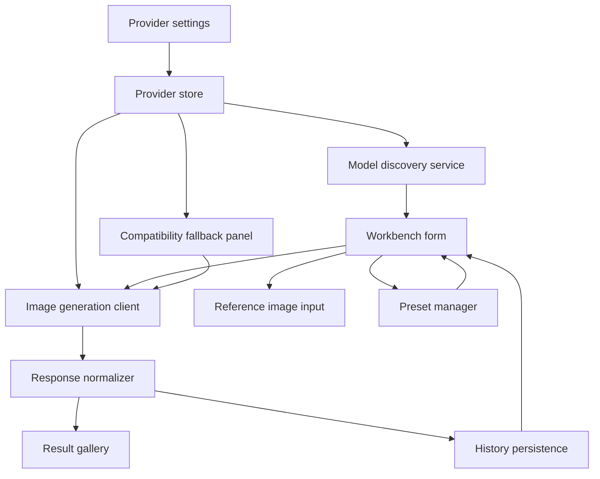
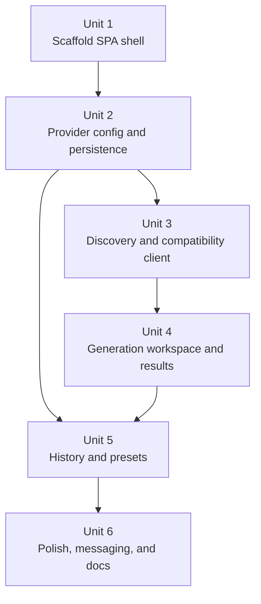

# feat: Build OpenAI-compatible image workbench

## Overview

Build a browser-first single-page image workbench for personal local use. The app should let the user save one or more third-party OpenAI-compatible provider configs, discover models, select or override an image-capable model, generate images from prompts or reference images, and reuse prior work through local history and presets.

This is a greenfield plan. The repository currently contains only the brainstorm artifact, so the plan must establish the initial app structure while preserving the product boundaries from the origin document.

## Problem Frame

The target workflow is creative, not diagnostic. The user wants a tool that feels like a focused image workstation rather than a generic API console: fast prompt entry, obvious provider switching, immediate visual feedback, and low-friction reuse of previous results. At the same time, third-party compatibility is uneven, so the implementation must handle partial OpenAI compatibility without making the product feel like a debugging surface (see origin: `docs/brainstorms/2026-04-27-openai-compatible-image-workbench-requirements.md`).

## Requirements Trace

- R1. Persist and reuse one or more provider configurations locally.
- R2. Perform standard model discovery and show clear success or failure states.
- R3. Highlight likely image-capable models while allowing manual model selection.
- R4. Provide a compatibility fallback path when standard discovery or generation setup fails.
- R5. Keep text-to-image as the primary workflow and primary screen focus.
- R6. Support reference-image-based generation in the main workspace.
- R7. Expose common generation controls without overcommitting to provider-specific options.
- R8. Preview generated images immediately and allow download.
- R9. Support fast iteration by reusing prior results into the next run.
- R10. Normalize progress, success, and failure states.
- R11. Persist recent history locally with enough context to reopen work quickly.
- R12. Support reusable presets.
- R13. Allow duplicate/edit/rerun from history and presets.
- R14. Clearly communicate that credentials stay in the browser for personal local use.
- R15. Narrow unsupported features gracefully rather than breaking the whole app.

## Scope Boundaries

- No backend proxy, account system, or cloud sync.
- No localized edit/inpaint workflow in the first release.
- No provider-specific bespoke integrations beyond the generic compatibility fallback.
- No packaging work for Tauri/Electron in this phase; the app should only remain packaging-friendly.
- No benchmarking or advanced request inspector UX as a primary use case.

## Context & Research

### Relevant Code and Patterns

- The repo currently has no application code, package manifest, or frontend scaffold. This was verified by scanning the workspace and finding only `docs/brainstorms/2026-04-27-openai-compatible-image-workbench-requirements.md`.
- Because there is no local pattern to follow, the plan should establish a simple browser-first structure with clear separation between UI features, provider transport, and persistence.
- The app should be served over an HTTP dev/build server rather than opened from `file:` URLs because browser local persistence behavior is not reliable there.

### Institutional Learnings

- None found in this repository. Treat this as a clean greenfield implementation.

### External References

- OpenAI Models API supports model listing and is the standard discovery starting point: [Models API](https://developers.openai.com/api/reference/resources/models/methods/list)
- OpenAI image generation supports a dedicated image flow and model-dependent options: [Image Generation Guide](https://developers.openai.com/api/docs/guides/image-generation)
- Open WebUI demonstrates a practical standard-first approach with endpoint, API version, and model overrides for OpenAI-compatible image backends such as Azure and LiteLLM: [Open WebUI OpenAI Images](https://docs.openwebui.com/features/media-generation/image-generation-and-editing/openai/)
- `localStorage` persists string data across browser sessions but is origin-scoped and unreliable on `file:` URLs: [MDN localStorage](https://developer.mozilla.org/en-US/docs/Web/API/Window/localStorage)
- IndexedDB is suited for larger structured data and file/blob storage: [MDN IndexedDB](https://developer.mozilla.org/en-US/docs/Web/API/IndexedDB_API)
- Blob previews can use object URLs that must be revoked during cleanup: [MDN createObjectURL](https://developer.mozilla.org/en-US/docs/Web/API/URL/createObjectURL_static)

## Key Technical Decisions

- Use a browser-first React + TypeScript + Vite SPA for the initial codebase. This keeps the product aligned with the chosen browser-first scope while remaining easy to wrap later in a desktop shell.
- Use `fetch`-based provider clients instead of a high-level SDK. Third-party `baseURL` variance, custom headers, custom query params, and endpoint overrides need low-level request control.
- Split local persistence by data shape: use `localStorage` for provider configs, presets, and lightweight metadata; use IndexedDB for generation history records that may include image blobs or larger payload snapshots.
- Keep compatibility fallback intentionally narrow. The first release should support only the minimum override surface needed to salvage partially compatible providers:
  - manual model id
  - optional model-discovery bypass
  - optional image endpoint override
  - optional extra headers and query params
  - capability toggles for reference-image support and result decoding mode
- Keep browser code free of Node-only APIs. Downloads, file previews, and persistence should use browser primitives so future desktop packaging is a wrapper exercise rather than a rewrite.

## Open Questions

### Resolved During Planning

- Which frontend stack should greenfield work use? React + TypeScript + Vite, because the repo has no existing stack and the product is a browser-first SPA with future packaging as a secondary concern.
- How much compatibility surface should the first release expose? A narrow fallback panel focused on request routing and capability toggles, not a full request editor.
- How should persistence be split? Small config and preset records go into `localStorage`; larger history items and image blobs go into IndexedDB.

### Deferred to Implementation

- Which exact heuristic should mark a discovered model as "likely image-capable"? Use a conservative default heuristic in execution, then refine against real providers if false positives become noisy.
- What is the exact retention cap for stored history images? Final values should be tuned during implementation after seeing realistic payload sizes and UX tradeoffs.
- Which optional generation controls should be always visible versus dynamically revealed? Final UI thresholds can be adjusted once the basic capability metadata pipeline exists.

## High-Level Technical Design

> *This illustrates the intended approach and is directional guidance for review, not implementation specification. The implementing agent should treat it as context, not code to reproduce.*

## Implementation Units

- [ ] **Unit 1: Scaffold the browser-first SPA shell**

**Goal:** Establish the base application structure, visual shell, and browser-first runtime assumptions for the workbench.

**Requirements:** R5, R10, R14

**Dependencies:** None

**Files:**
- Create: `package.json`
- Create: `tsconfig.json`
- Create: `vite.config.ts`
- Create: `index.html`
- Create: `src/main.tsx`
- Create: `src/app/App.tsx`
- Create: `src/app/routes.tsx`
- Create: `src/styles/tokens.css`
- Create: `src/styles/global.css`
- Create: `src/components/layout/app-shell.tsx`
- Create: `src/components/layout/workbench-frame.tsx`
- Create: `src/components/status/empty-state.tsx`
- Create: `src/components/status/loading-state.tsx`
- Create: `src/test/setup.ts`
- Create: `src/app/App.test.tsx`

**Approach:**
- Start with a single-screen SPA shell that matches the intended workbench layout: creation canvas on the left, provider/config controls on the right, result/history area below or alongside depending on viewport.
- Include an always-visible local-only trust hint near provider settings so the credential boundary is visible before any generation happens.
- Establish app-level state boundaries early: layout and theme state at app level, domain state delegated to feature stores/services in later units.
- Keep routing minimal. Even if only one page exists now, using an app entry structure avoids repainting the whole architecture later when desktop settings or a gallery route is introduced.

**Execution note:** Implement the shell with a failing UI smoke test first so future refactors preserve the main structural regions.

**Patterns to follow:**
- Vite React app conventions for entry and static asset handling.
- Feature-first foldering under `src/components`, `src/features`, and `src/lib` rather than a flat single-file app.

**Test scenarios:**
- Happy path: App bootstrap renders prompt region, provider settings region, and result placeholder in a single screen.
- Edge case: On a narrow viewport, the layout collapses without hiding provider settings or making the primary generate action inaccessible.
- Error path: If persisted app state cannot be read, the shell still renders with safe defaults and a non-blocking notice.

**Verification:**
- The app starts into a stable workbench shell with no provider configured and clearly communicates that setup is required before generation.

- [ ] **Unit 2: Build provider configuration, persistence, and selection**

**Goal:** Let the user create, edit, persist, and switch between provider configurations for local reuse.

**Requirements:** R1, R2, R14

**Dependencies:** Unit 1

**Files:**
- Create: `src/features/providers/provider-settings-panel.tsx`
- Create: `src/features/providers/provider-form.tsx`
- Create: `src/features/providers/provider-list.tsx`
- Create: `src/features/providers/provider-store.ts`
- Create: `src/features/providers/provider-types.ts`
- Create: `src/lib/storage/local-config-store.ts`
- Create: `src/lib/validation/provider-validation.ts`
- Create: `src/features/providers/provider-store.test.ts`
- Create: `src/lib/storage/local-config-store.test.ts`

**Approach:**
- Represent provider configurations as named local records rather than one global config so the user can quickly switch between multiple third-party endpoints.
- Store `baseURL`, `apiKey`, and lightweight fallback metadata in a normalized local config format.
- Distinguish saved provider records from the currently active provider so edits do not accidentally mutate the active session until explicitly confirmed.
- Add validation that catches obvious malformed inputs early, but do not enforce provider-specific rules that would block legitimate nonstandard setups.

**Execution note:** Start with store and persistence contract tests before wiring the panel UI.

**Patterns to follow:**
- Browser-origin persistence guidance from MDN `localStorage`.
- App-level domain store conventions established in Unit 1.

**Test scenarios:**
- Happy path: Saving a valid provider config persists it and makes it selectable in a later browser session.
- Happy path: Switching the active provider updates the workbench context without losing unsaved prompt content.
- Edge case: Creating multiple providers with similar names still preserves unique stable ids and correct selection behavior.
- Edge case: An empty saved-provider list renders a first-run setup state instead of a broken selector.
- Error path: Corrupted persisted provider data is ignored or repaired with defaults rather than crashing the settings panel.

**Verification:**
- The user can maintain multiple named providers locally and reactivate any prior provider without re-entering credentials.

- [ ] **Unit 3: Implement model discovery and compatibility-aware provider client**

**Goal:** Connect saved providers to standard model discovery and a narrow compatibility fallback surface.

**Requirements:** R2, R3, R4, R10, R15

**Dependencies:** Unit 2

**Files:**
- Create: `src/lib/openai/openai-compatible-client.ts`
- Create: `src/lib/openai/model-discovery.ts`
- Create: `src/lib/openai/image-request-builder.ts`
- Create: `src/lib/openai/response-normalizer.ts`
- Create: `src/lib/openai/provider-capabilities.ts`
- Create: `src/features/providers/model-selector.tsx`
- Create: `src/features/providers/compatibility-fallback-panel.tsx`
- Create: `src/lib/openai/openai-compatible-client.test.ts`
- Create: `src/lib/openai/model-discovery.test.ts`
- Create: `src/lib/openai/response-normalizer.test.ts`

**Approach:**
- Make the standard path the default: discover models from the configured provider, infer likely image-capable models, and hydrate the selector automatically when possible.
- Normalize provider interactions behind a single client boundary that emits typed domain outcomes: discovery success, discovery unavailable, generation supported, reference-image unsupported, response parse failure, and transport failure.
- Keep the fallback panel narrow and conditional. It should appear only after a failed standard attempt or when the user explicitly opts in. The fallback should not expose arbitrary request-body editing.
- Treat discovery and generation as related but separate capabilities. A provider may fail discovery but still work for generation when given a manual model id and endpoint override.

**Execution note:** Implement request/response contract tests first with mocked fetch responses for both standard and fallback paths.

**Technical design:** *(directional guidance, not implementation specification)*
- Standard mode flow: provider config -> `GET /v1/models` -> image-capability heuristic -> image request builder -> response normalizer.
- Fallback mode flow: provider config + override surface -> optional discovery bypass -> explicit endpoint and capability metadata -> image request builder -> response normalizer.

**Patterns to follow:**
- OpenAI model-list and image-generation contract shape.
- Open WebUI's standard-first pattern with targeted override fields for Azure/LiteLLM-style variants.

**Test scenarios:**
- Happy path: Standard discovery returns models and marks likely image-capable models prominently while preserving the full list for manual selection.
- Happy path: Standard generation request builds correctly for a plain text-to-image flow and normalizes a valid image result into a gallery-ready record.
- Edge case: Discovery succeeds but no likely image model is found; the UI still allows manual selection and fallback entry.
- Edge case: Discovery fails while manual fallback data exists; generation remains possible without blocking on model list success.
- Error path: Provider returns a transport or authorization error; the client surfaces a normalized error state with both concise and expandable detail.
- Error path: Provider returns an unexpected response envelope; the normalizer fails gracefully and points the user toward fallback/result-mode adjustment instead of showing a blank success state.
- Integration: Changing fallback capability flags narrows the workspace options immediately, such as disabling reference-image mode when the provider is marked text-only.

**Verification:**
- A provider can be used through the standard path when compatible, and can still be salvaged through the fallback path when partially compatible.

- [ ] **Unit 4: Build the generation workspace, reference-image flow, and result gallery**

**Goal:** Deliver the primary creator workflow for prompt-driven and reference-image-based generation.

**Requirements:** R5, R6, R7, R8, R9, R10, R15

**Dependencies:** Unit 3

**Files:**
- Create: `src/features/workbench/generation-form.tsx`
- Create: `src/features/workbench/prompt-editor.tsx`
- Create: `src/features/workbench/reference-image-dropzone.tsx`
- Create: `src/features/workbench/generation-controls.tsx`
- Create: `src/features/workbench/generation-actions.tsx`
- Create: `src/features/results/result-gallery.tsx`
- Create: `src/features/results/result-card.tsx`
- Create: `src/features/results/result-preview-modal.tsx`
- Create: `src/features/results/download-image.ts`
- Create: `src/features/workbench/generation-form.test.tsx`
- Create: `src/features/results/result-gallery.test.tsx`

**Approach:**
- Make the prompt editor the visual center of the screen, with provider/model state close enough to be understandable but not dominant.
- Keep text-to-image as the baseline mode and progressively reveal reference-image affordances only when the active provider/model capability allows them.
- Use browser file inputs and object URLs for immediate reference-image preview and generated-image preview. Ensure object URLs are revoked when items are removed or components unmount.
- Reuse from prior output should be one-click from the result gallery: "use as reference", "reuse prompt", and "rerun with current provider" where valid.
- Keep model-dependent controls adaptive. Always show the most common controls, and defer niche provider-specific options behind a secondary area rather than bloating the default form.

**Execution note:** Implement UI behavior test-first around mode switching, disabled states, and result reuse affordances.

**Patterns to follow:**
- Browser file handling and object URL lifecycle guidance from MDN.
- Error and loading primitives established in earlier units.

**Test scenarios:**
- Happy path: Entering a prompt with a compatible provider generates an image, shows progress while pending, and renders a downloadable result card on success.
- Happy path: Uploading a reference image in a provider that supports it updates the form state, preview state, and generation payload path correctly.
- Edge case: Switching to a provider that does not support reference images preserves the uploaded file in local UI state only if the user remains in the same editing session, but disables the generation mode and explains why.
- Edge case: A generated result can be reused as the next reference image without requiring a manual download-and-reupload round trip.
- Error path: Generation failure leaves prompt and reference-image inputs intact so the user can retry after changing provider or compatibility settings.
- Error path: A user attempts reference-image generation while the active capability metadata marks it unsupported; the action is blocked with clear guidance rather than silently downgraded.
- Integration: Downloading an image from the result gallery yields a valid browser download without corrupting the stored preview record.

**Verification:**
- The main workbench supports both text-to-image and reference-image generation without turning provider configuration into the dominant interaction.

- [ ] **Unit 5: Add local history, presets, and quick rerun flows**

**Goal:** Make repeated creative work faster through durable local reuse.

**Requirements:** R9, R11, R12, R13

**Dependencies:** Unit 2, Unit 4

**Files:**
- Create: `src/features/history/history-panel.tsx`
- Create: `src/features/history/history-store.ts`
- Create: `src/features/history/history-types.ts`
- Create: `src/features/history/history-retention.ts`
- Create: `src/features/presets/preset-panel.tsx`
- Create: `src/features/presets/preset-store.ts`
- Create: `src/lib/storage/indexeddb-history-store.ts`
- Create: `src/features/history/history-store.test.ts`
- Create: `src/features/presets/preset-store.test.ts`
- Create: `src/lib/storage/indexeddb-history-store.test.ts`

**Approach:**
- Store history records as lightweight metadata plus references to any blob-backed image assets in IndexedDB so the app can reopen prior work without depending on remote provider URLs remaining valid.
- Use presets for intentional reusable setups and history for passive recall of recent work. They should be related but not merged into a single concept.
- Retention should favor usefulness over completeness. Keep a bounded recent history with cleanup hooks rather than trying to persist unlimited binary data.
- Support one-click actions on history and presets: duplicate into editor, rerun, save as preset, and reuse result as reference if the stored asset is still available.

**Execution note:** Start with persistence contract tests that cover retention and history hydration before building the panels.

**Patterns to follow:**
- IndexedDB suitability for larger structured data and blobs.
- Local store conventions established by provider persistence.

**Test scenarios:**
- Happy path: A successful generation writes a history entry that can be reopened after a browser refresh with prompt, provider label, and preview intact.
- Happy path: Saving a preset from the current editor state makes it available for quick reapplication in a later session.
- Edge case: History cleanup removes the oldest entries first while preserving metadata consistency and not orphaning preview references.
- Edge case: Reopening history from a provider that no longer exists still preserves the creative context and offers rerun only after the user selects or repairs a provider.
- Error path: IndexedDB write failure degrades gracefully by preserving the current session result in memory and warning that durable history was not saved.
- Integration: Promoting a history item into a preset preserves reusable settings but excludes transient run-state fields such as in-flight status.

**Verification:**
- The app becomes materially faster to reuse over time because results, prompts, and favorite setups survive across sessions.

- [ ] **Unit 6: Polish failure messaging, accessibility, onboarding, and project docs**

**Goal:** Finish the greenfield app with the trust, guidance, and maintainability basics needed for real daily use.

**Requirements:** R10, R14, R15

**Dependencies:** Unit 1, Unit 2, Unit 3, Unit 4, Unit 5

**Files:**
- Create: `README.md`
- Create: `src/features/onboarding/compatibility-help.tsx`
- Create: `src/components/status/error-detail-drawer.tsx`
- Create: `src/components/feedback/toast-region.tsx`
- Create: `tests/e2e/workbench.spec.ts`
- Create: `tests/e2e/history-and-presets.spec.ts`
- Modify: `package.json`

**Approach:**
- Add a short first-run explanation for local-only storage, expected provider compatibility limits, and how to recover when discovery fails.
- Keep error copy concise by default with expandable technical detail when the user needs to troubleshoot a provider.
- Add accessibility passes for focus order, file-input labeling, loading announcements, and keyboard access for core result actions.
- Capture the app's local-run assumptions in `README.md`, including the need to run through a dev/build server rather than opening files directly in the browser.

**Patterns to follow:**
- Status and feedback primitives established in prior units.
- Documentation scope aligned with the origin document's personal local-use boundary.

**Test scenarios:**
- Happy path: First-run onboarding communicates local-only credential storage and the standard-first/fallback-second model without blocking creation once a provider is configured.
- Edge case: Keyboard-only navigation can reach provider setup, generate action, result reuse, history rerun, and preset save actions in a stable order.
- Error path: A provider with discovery failure still surfaces actionable fallback guidance rather than a dead-end error wall.
- Integration: End-to-end flows cover standard provider success and a simulated partially compatible provider that requires fallback fields.

**Verification:**
- A new local user can understand setup boundaries, recover from common compatibility failures, and keep using the workbench without external documentation for the main path.

## System-Wide Impact

- **Interaction graph:** Provider settings feed both model discovery and generation; generation output feeds result gallery and history; history and presets feed back into the workbench editor.
- **Error propagation:** Provider transport, auth, parsing, and capability mismatches should normalize into shared UI-friendly error states rather than leaking fetch-layer details into every component.
- **State lifecycle risks:** Generated previews and reference-image previews use object URLs that must be revoked; history blobs need bounded retention to avoid runaway browser storage growth.
- **API surface parity:** The same provider abstraction should support discovery, text generation, and reference-image generation so fallback choices stay consistent across those surfaces.
- **Integration coverage:** Unit tests alone will not prove browser persistence, object URL cleanup, and standard-to-fallback recovery flows; keep end-to-end coverage for those paths.
- **Unchanged invariants:** The first release remains browser-only, local-only, and provider-agnostic. This plan does not add a server, cloud sync, or provider-specific hardcoded branches.

## Risks & Dependencies

| Risk | Mitigation |
|------|------------|
| Third-party providers may block browser-origin requests with CORS or stricter auth policies | Make this limitation explicit in onboarding and error copy; keep future desktop wrapping possible without changing app architecture |
| Providers may claim OpenAI compatibility but diverge on endpoints, query params, or response envelopes | Use a narrow fallback panel with endpoint, header, query, and capability overrides rather than assuming full standard parity |
| Large generated images may bloat browser storage and degrade history performance | Store heavy assets in IndexedDB, bound history retention, and clean up object URLs and stale blobs |
| Overexposing compatibility controls could turn the product into a debugging console | Hide fallback behind failure or explicit opt-in, and constrain it to the smallest useful field set |
| The repo has no preexisting toolchain, so initial setup mistakes could slow all later work | Land the scaffold, test setup, and project conventions in Unit 1 before feature-specific implementation |

## Documentation / Operational Notes

- Document local-run expectations in `README.md`, including browser support assumptions and the need to run through an HTTP server.
- Capture a short provider-compatibility troubleshooting note in-app and in the README rather than writing long provider-specific docs.
- Keep future desktop packaging out of this implementation phase, but avoid browser-hostile assumptions that would block wrapping later.

## Sources & References

- **Origin document:** [docs/brainstorms/2026-04-27-openai-compatible-image-workbench-requirements.md](../brainstorms/2026-04-27-openai-compatible-image-workbench-requirements.md)
- External docs: [OpenAI Models API](https://developers.openai.com/api/reference/resources/models/methods/list)
- External docs: [OpenAI Image Generation Guide](https://developers.openai.com/api/docs/guides/image-generation)
- External docs: [Open WebUI OpenAI Images](https://docs.openwebui.com/features/media-generation/image-generation-and-editing/openai/)
- External docs: [MDN localStorage](https://developer.mozilla.org/en-US/docs/Web/API/Window/localStorage)
- External docs: [MDN IndexedDB](https://developer.mozilla.org/en-US/docs/Web/API/IndexedDB_API)
- External docs: [MDN createObjectURL](https://developer.mozilla.org/en-US/docs/Web/API/URL/createObjectURL_static)
