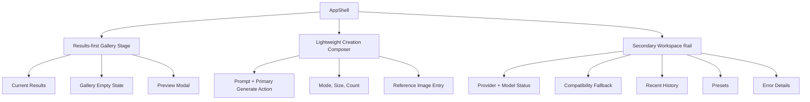

# refactor: Results-first inspiration gallery workbench

## Overview

Refactor GPT Image Workbench from a form-forward control surface into a results-first inspiration gallery. The new interaction model should make current results and recent creative output the visual center of the product, while keeping prompt entry fast and moving provider compatibility controls into a secondary but discoverable layer.

The plan preserves the existing local-only product capabilities from the origin requirements: OpenAI-compatible provider configuration, model discovery, text-to-image generation, reference-image generation, result preview/download/reuse, local history, presets, compatibility fallback, and detailed error recovery.

---

## Problem Frame

The current product satisfies the functional workbench requirements but visually reads closer to a configuration-heavy console than a lightweight creative tool. The user wants a full visual and interaction refactor, with direction already selected as an inspiration-gallery style and first-round priority set to results-first presentation.

The origin document defines the product as a browser-first personal image-generation workbench that should feel like a lightweight standalone creative tool rather than a developer console (see origin: `docs/brainstorms/2026-04-27-openai-compatible-image-workbench-requirements.md`). This plan changes layout, hierarchy, and interaction emphasis without expanding the product into collaborative, cloud, benchmarking, or debugging-console territory.

---

## Requirements Trace

- R1. Preserve local provider entry, persistence, switching, and reuse.
- R2. Preserve model discovery and clear discovery success/failure states.
- R3. Preserve likely image-model highlighting and manual model choice.
- R4. Keep compatibility fallback available when standard discovery or generation setup fails.
- R5. Keep prompt entry fast, but make generated output and gallery browsing the visual center of the screen.
- R6. Preserve text-to-image and reference-image workflows in the same workspace.
- R7. Preserve common generation controls, while reducing default visual noise for less frequent controls.
- R8. Preserve immediate preview and individual download for generated images.
- R9. Preserve fast iteration by allowing result reuse as prompt context or reference image.
- R10. Preserve clear in-progress, success, and failure states, including optional expanded provider error details.
- R11. Keep recent local history visible enough to support browsing and reopening prior work.
- R12. Preserve user-defined presets/templates.
- R13. Preserve duplicate/edit/rerun behavior for previous history items or presets.
- R14. Preserve local credential storage communication.
- R15. Preserve graceful narrowing/disablement for unsupported provider capabilities.
- SC1. A user can still go from empty session to first generated image without external documentation.
- SC2. Repeated creative work becomes faster over time because results, history, and presets are easier to recognize and reuse.

---

## Scope Boundaries

- Do not add server-side proxy behavior, cloud credential storage, accounts, collaboration, or multi-device sync.
- Do not add localized image editing, inpainting, masking, or a node-based workflow.
- Do not introduce a general request debugger or provider benchmarking surface.
- Do not replace the existing React/Vite architecture or add a design-system dependency unless implementation proves the current CSS structure cannot support the design.
- Do not change provider request semantics, persistence schema, or OpenAI-compatible client behavior as part of the visual refactor unless a small compatibility-preserving adjustment is required by the UI.

### Deferred to Follow-Up Work

- Rich gallery filtering, tagging, favorites, and multi-select batch actions should be treated as later gallery-product work, not part of this first results-first refactor.
- Desktop packaging and broader CORS strategy remain outside this visual/interaction pass.

---

## Context & Research

### Relevant Code and Patterns

- `src/app/App.tsx` owns application state and wires provider, generation, results, history, presets, toast, error drawer, and preview modal together.
- `src/components/layout/app-shell.tsx` and `src/components/layout/workbench-frame.tsx` provide the current page shell and two-column workbench layout.
- `src/styles/tokens.css` and `src/styles/global.css` hold the current token and global class-based styling approach.
- `src/features/results/result-gallery.tsx`, `src/features/results/result-card.tsx`, and `src/features/results/result-preview-modal.tsx` contain the current result display and actions.
- `src/features/workbench/generation-form.tsx`, `src/features/workbench/prompt-editor.tsx`, `src/features/workbench/reference-image-dropzone.tsx`, `src/features/workbench/generation-controls.tsx`, and `src/features/workbench/generation-actions.tsx` contain the current creation flow.
- `src/features/providers/provider-settings-panel.tsx`, `src/features/providers/provider-form.tsx`, `src/features/providers/provider-list.tsx`, and `src/features/providers/model-selector.tsx` contain provider configuration and model selection.
- `src/features/history/history-panel.tsx` and `src/features/presets/preset-panel.tsx` already provide local productivity surfaces that should be visually elevated in the gallery experience.
- Tests currently live beside feature files and in `tests/e2e/`; the refactor should preserve this convention.

### Institutional Learnings

- `docs/solutions/integration-issues/hc0-openai-compatible-image-generation-compatibility-2026-04-27.md` notes that model discovery compatibility and image-generation compatibility are separate concerns. The redesigned UI must not hide provider compatibility/fallback state so deeply that users cannot recover from partial compatibility.
- The same learning warns that provider profiles and request normalization matter. History, presets, and reuse UI should not imply that display values like `auto` necessarily map one-to-one to API payload fields.
- Generation errors should keep provider-specific recommendations available through the existing detail surface rather than only showing a generic failure banner.

### External References

- Adobe Firefly text-to-image pages and similar image generation tools use output-first browsing, visible prompts, and fast iteration affordances.
- Nielsen Norman Group progressive disclosure guidance supports keeping frequent creative actions visible while folding advanced or infrequent configuration.
- Nielsen Norman Group recognition-over-recall guidance supports visible recent images, presets, and reusable cards.
- Material Design card, navigation drawer, progress indicator, and snackbar guidance supports card-based gallery surfaces, secondary drawers/panels, non-blocking feedback, and clear in-progress state.

---

## Key Technical Decisions

- Results-first information architecture: Make the current result gallery and recent work the dominant central surface, with the creation form presented as a lightweight composer rather than the largest panel. This intentionally reinterprets origin R5 for the refactor: prompt entry remains the fastest primary action, but the page's visual weight shifts to output browsing because the user selected a results-first gallery direction.
- Progressive disclosure for configuration: Keep provider/model status visible, but move full provider settings and compatibility fallback into a secondary panel or drawer-like region so the main workspace stays creative.
- Compatibility fallback surface: Keep the smallest useful fallback visible through setup/error recovery: manual model, skip discovery, endpoint override, extra headers/query, reference support, and response mode. Do not expand it into a raw request editor or provider debugging console.
- Generation-control hierarchy: Always show prompt, mode, size, count, and primary generate action. Keep quality/output format available but lower visual weight; provider/model-dependent controls should appear only when the current provider capability makes them relevant.
- History retention posture: Preserve the existing local history behavior and cleanup semantics during this visual refactor; improve recognition and reuse presentation without changing retention policy or storage schema.
- Preserve App-level orchestration: Keep `src/app/App.tsx` as the integration point for now; this is an interaction refactor, not a state-management rewrite.
- Reuse existing global CSS: Extend `tokens.css` and `global.css` rather than introducing Tailwind, CSS Modules, or a component library.
- History and presets as creative inputs: Treat history and presets as part of the inspiration workflow, not administrative panels hidden below the fold.
- Error recovery remains visible: Generation and discovery failures should present concise in-context recovery plus access to detailed provider diagnostics.
- Mobile reachability: On narrow screens, gallery, composer, provider settings, history, and presets must remain reachable in a clear vertical order.

---

## Open Questions

### Resolved During Planning

- Primary UX direction: Inspiration gallery style.
- First refactor priority: Results-first layout.
- R4 fallback scope: Preserve the current compatibility fallback surface as the minimum useful recovery path; do not broaden it into a request debugger.
- R7 control hierarchy: Prompt, mode, size, count, and generate are always visible; quality/output format and provider-dependent controls are available with lower visual weight.
- R11 history behavior: Keep existing local history retention/storage behavior; this pass changes discoverability and reuse presentation, not data policy.
- External dependency posture: Use existing React/CSS architecture; do not add a new UI framework for this pass.
- Provider settings hierarchy: Demote to secondary/disclosed configuration, but keep current status and recovery paths discoverable.

### Deferred to Implementation

- Exact visual token values, spacing, and card dimensions: These should be tuned while implementing and browser-testing the page.
- Exact responsive breakpoints: Implementation should choose breakpoints that fit actual content density after layout changes.
- Whether a lightweight local component split is needed for the composer or gallery shell: Decide while editing existing components to avoid premature abstraction.

---

## High-Level Technical Design

> *This illustrates the intended approach and is directional guidance for review, not implementation specification. The implementing agent should treat it as context, not code to reproduce.*

The main experience should read as: browse results -> adjust prompt/controls -> generate -> reuse result/history/preset -> repeat. Provider configuration should remain available as setup and recovery support, not as the visual centerpiece.

---

## Implementation Units

- U1. **Restructure the workbench shell around a results-first stage**

**Goal:** Replace the current hero/sidebar/lower layout hierarchy with a page structure where the result gallery is the dominant central surface and creation/configuration surfaces sit around it with lower visual weight.

**Requirements:** R5, R8, R10, R11, SC1, SC2

**Dependencies:** None

**Files:**
- Modify: `src/components/layout/app-shell.tsx`
- Modify: `src/components/layout/workbench-frame.tsx`
- Modify: `src/app/App.tsx`
- Modify: `src/styles/global.css`
- Modify: `src/styles/tokens.css`
- Test: `src/app/App.test.tsx`
- Test: `tests/e2e/workbench.spec.ts`

**Approach:**
- Introduce a layout vocabulary that separates gallery stage, composer area, and secondary workspace rail while preserving existing props and App-level state flow where practical.
- Reduce masthead dominance so the product chrome supports the workspace rather than pushing gallery content down.
- Keep result preview modal, toast region, error drawer, and loading state wired through the existing App-level orchestration.
- Ensure an empty first-run state still leads users toward provider setup and prompt entry rather than showing a dead gallery.

**Patterns to follow:**
- Keep layout components simple and presentational like `src/components/layout/app-shell.tsx` and `src/components/layout/workbench-frame.tsx`.
- Preserve App-level callback wiring from `src/app/App.tsx` instead of introducing a new global state layer.

**Test scenarios:**
- Happy path: With a configured provider and no current results, the page renders the gallery stage, composer entry, and secondary provider/history surfaces without hiding the generate path.
- Happy path: After generation state produces results, result cards appear in the dominant gallery region and retain preview/download/reuse actions.
- Edge case: With no provider configured, the gallery empty state gives a visible path to connection setup and does not present generation as ready.
- Edge case: On a narrow viewport, gallery, composer, provider setup, history, and presets remain reachable in a logical vertical order.
- Integration: Existing preview modal and error drawer still open from the refactored layout.

**Verification:**
- The initial screen visually prioritizes the result/gallery area.
- No existing top-level workbench capability disappears from the rendered app.
- E2E coverage confirms the golden creation path remains reachable.

---

- U2. **Promote result cards into an inspiration gallery experience**

**Goal:** Make current results and reusable visual output feel like the primary product surface, with stronger cards, clearer reuse actions, and better empty/loading/error states.

**Requirements:** R8, R9, R10, R11, R13, SC2

**Dependencies:** U1

**Files:**
- Modify: `src/features/results/result-gallery.tsx`
- Modify: `src/features/results/result-card.tsx`
- Modify: `src/features/results/result-preview-modal.tsx`
- Modify: `src/components/status/empty-state.tsx`
- Modify: `src/components/status/loading-state.tsx`
- Modify: `src/styles/global.css`
- Test: `src/features/results/result-gallery.test.tsx`
- Test: `tests/e2e/workbench.spec.ts`

**Approach:**
- Redesign result cards as visual-first inspiration cards with image emphasis and action hierarchy for preview, download, reuse prompt, and use as reference.
- Replace generic empty messaging with a creative first-run state that explains the next best action based on provider/readiness state.
- During generation, preserve already-rendered results and add non-destructive progress indication rather than visually replacing the whole workspace.
- Keep actions semantically aligned across current results, history items, and presets.

**Patterns to follow:**
- Preserve `ResultGallery` and `ResultCard` callback-driven component boundaries.
- Reuse `EmptyState`/`LoadingState` where possible instead of creating one-off status components.

**Test scenarios:**
- Happy path: Rendering multiple result images produces a responsive gallery and each card exposes preview, download, prompt reuse, and reference reuse actions.
- Happy path: Clicking preview opens the existing preview modal for the selected image.
- Happy path: Clicking use-as-reference passes the selected image into the reference-image workflow.
- Edge case: Empty current results show a creative empty state rather than a blank panel.
- Edge case: Generation in progress does not remove existing results from view.
- Error path: A generation failure can be shown without losing current results or prompt context.

**Verification:**
- Result cards remain keyboard and pointer accessible.
- Existing result action tests still pass or are updated to reflect the new visual hierarchy without changing action semantics.

---

- U3. **Convert the generation form into a lightweight creative composer**

**Goal:** Reduce form heaviness while keeping prompt entry, reference image mode, core controls, and generate/clear actions fast and obvious.

**Requirements:** R5, R6, R7, R9, R15, SC1

**Dependencies:** U1

**Files:**
- Modify: `src/features/workbench/generation-form.tsx`
- Modify: `src/features/workbench/prompt-editor.tsx`
- Modify: `src/features/workbench/reference-image-dropzone.tsx`
- Modify: `src/features/workbench/generation-controls.tsx`
- Modify: `src/features/workbench/generation-actions.tsx`
- Modify: `src/styles/global.css`
- Test: `src/features/workbench/generation-form.test.tsx`
- Test: `tests/e2e/workbench.spec.ts`

**Approach:**
- Reframe the generation form as a composer: prompt and primary generate action first, frequent controls nearby, less frequent controls visually grouped or disclosed.
- Keep text and reference modes available without turning reference upload into the dominant visual element when text mode is active.
- Provide an explicit visual indicator in the composer when a reference image is attached so users can tell the next request includes image context.
- Preserve disabled states for unsupported reference images and missing provider/model readiness.
- Keep clear/reset action available but visually secondary to generation.

**Patterns to follow:**
- Keep `GenerationFormState` unchanged unless implementation proves a minimal shape adjustment is necessary.
- Preserve the existing controlled component callbacks from `generation-form.tsx`.

**Test scenarios:**
- Happy path: Typing a prompt and clicking generate invokes `onGenerate` when `canGenerate` is true.
- Happy path: Changing size, count, quality, and output format still calls `onChangeForm` with the expected values.
- Happy path: Switching to reference mode and selecting a file preserves reference preview behavior and visibly marks the next generation request as reference-image-based.
- Edge case: When the selected provider does not support reference images, reference mode is visibly unavailable or narrowed and cannot silently submit an unsupported request.
- Edge case: Clear resets prompt/control/reference state through the existing `onClear` behavior.
- Error path: When generation fails at the App level, composer content remains available for retry.

**Verification:**
- The prompt entry is visually prominent but no longer competes with the result stage for primary page dominance.
- Existing unit tests around generation form state and callbacks continue to prove behavior.

---

- U4. **Demote provider and compatibility controls into a discoverable secondary layer**

**Goal:** Keep provider setup, model discovery, local credential messaging, and compatibility fallback usable while preventing them from dominating the creative workspace.

**Requirements:** R1, R2, R3, R4, R10, R14, R15, SC1

**Dependencies:** U1, U3

**Files:**
- Modify: `src/features/providers/provider-settings-panel.tsx`
- Modify: `src/features/providers/provider-form.tsx`
- Modify: `src/features/providers/provider-list.tsx`
- Modify: `src/features/providers/model-selector.tsx`
- Modify: `src/features/providers/compatibility-fallback-panel.tsx`
- Modify: `src/components/status/error-detail-drawer.tsx`
- Modify: `src/styles/global.css`
- Test: `src/features/providers/provider-store.test.ts`
- Test: `src/app/App.test.tsx`
- Test: `tests/e2e/workbench.spec.ts`

**Approach:**
- Present provider/model readiness as a compact status surface near the composer or secondary rail.
- Keep full provider form, discovery results, and compatibility fallback behind an explicit configuration affordance rather than always sharing primary visual weight with creation.
- Preserve local credential storage messaging and fallback recovery recommendations.
- Ensure discovery/generation errors link users toward the relevant provider or compatibility setting instead of dead-ending.

**Patterns to follow:**
- Keep provider persistence and validation behavior in existing store/validation modules.
- Follow current provider component separation: list, form, model selector, fallback panel.

**Test scenarios:**
- Happy path: Saving or testing a provider attempts standard model discovery and surfaces the resulting success state near provider/model readiness.
- Happy path: Successful model discovery still displays likely image models and allows manual selection.
- Error path: Discovery failure exposes compatibility fallback without requiring the user to leave the workbench.
- Error path: Provider validation errors remain visible when attempting to save incomplete provider details.
- Edge case: No provider configured shows a clear setup path from the main workbench.
- Edge case: Local credential messaging remains visible in the provider configuration layer.

**Verification:**
- Provider setup is less visually dominant but still discoverable from first-run, error, and settings states.
- Compatibility fallback remains reachable in partially compatible provider flows.

---

- U5. **Elevate history and presets as reusable inspiration surfaces**

**Goal:** Make history and presets support gallery-style iteration by presenting them as recognizable, reusable creative assets rather than secondary administrative lists.

**Requirements:** R9, R11, R12, R13, SC2

**Dependencies:** U1, U2, U3

**Files:**
- Modify: `src/features/history/history-panel.tsx`
- Modify: `src/features/history/history-store.ts`
- Modify: `src/features/presets/preset-panel.tsx`
- Modify: `src/features/presets/preset-store.ts`
- Modify: `src/app/App.tsx`
- Modify: `src/styles/global.css`
- Test: `src/features/history/history-store.test.ts`
- Test: `src/features/presets/preset-store.test.ts`
- Test: `tests/e2e/history-and-presets.spec.ts`

**Approach:**
- Present recent history and presets as part of the inspiration loop in the secondary workspace rail or gallery-adjacent section.
- Preserve existing storage behavior and avoid changing persistence schema unless the UI requires a backward-compatible display-only addition.
- Clarify the difference between reusing a prompt, applying a preset, and using an image as a reference.
- Handle history records whose provider no longer exists with a recovery-oriented message instead of a broken rerun path.

**Patterns to follow:**
- Keep existing history/preset stores and App-level callbacks.
- Preserve tests around retention and preset persistence.

**Test scenarios:**
- Happy path: A generated result appears in history and can be reopened or reused from the new inspiration surface.
- Happy path: Saving a preset from the current form makes it available for later application.
- Happy path: Applying a preset updates the composer fields without overwriting unrelated provider configuration.
- Edge case: Empty history and empty presets show useful creative guidance rather than empty administrative panels.
- Edge case: A history item tied to a deleted provider remains readable and offers safe reuse where possible.
- Integration: Reusing history/preset content flows back into the composer and can drive a new generation.

**Verification:**
- History and presets are more visible in the creative loop without changing their persistence guarantees.
- Existing store tests continue to pass, confirming visual refactor did not alter data semantics.

---

- U6. **Refresh visual system and responsive polish**

**Goal:** Apply a cohesive gallery-oriented visual language across tokens, surfaces, cards, controls, focus states, and responsive layouts.

**Requirements:** R5, R8, R10, R14, R15, SC1, SC2

**Dependencies:** U1, U2, U3, U4, U5

**Files:**
- Modify: `src/styles/tokens.css`
- Modify: `src/styles/global.css`
- Modify: `src/components/feedback/toast-region.tsx`
- Modify: `src/components/status/empty-state.tsx`
- Modify: `src/components/status/loading-state.tsx`
- Modify: `src/components/status/error-detail-drawer.tsx`
- Test: `src/app/App.test.tsx`
- Test: `tests/e2e/workbench.spec.ts`

**Approach:**
- Shift tokens and surface styles toward a visual-product feel: strong image cards, softer chrome, clear primary actions, and subdued configuration surfaces.
- Maintain accessible contrast, visible focus states, and readable form controls.
- Use skeleton/progress treatments that preserve context during generation.
- Ensure toast and error detail surfaces remain visible without covering core composer actions unnecessarily.

**Patterns to follow:**
- Continue using global class-based styles from `global.css` and design tokens from `tokens.css`.
- Avoid adding decorative complexity that increases maintenance cost without improving the core creation loop.

**Test scenarios:**
- Happy path: Main workbench renders correctly at desktop and mobile viewport sizes.
- Edge case: Long prompts, long provider names, and multiple result cards do not break the layout.
- Edge case: Keyboard focus remains visible on composer controls, result card actions, provider settings, history actions, and modal/drawer controls.
- Error path: Toast and error drawer remain readable and actionable on narrow screens.

**Verification:**
- Browser validation confirms the golden path and major edge states look coherent across desktop and narrow layouts.
- Accessibility-critical affordances such as labels, focus, and disabled states remain intact.

---

## System-Wide Impact

- **Interaction graph:** `src/app/App.tsx` remains the integration hub. Layout changes must preserve callbacks connecting generation, provider selection, history, presets, result actions, preview modal, toast, and error drawer.
- **Error propagation:** Discovery and generation errors should still flow to concise UI messaging plus `ErrorDetailDrawer`; the redesign should add recovery placement, not swallow detail.
- **State lifecycle risks:** Existing prompt/reference/result/history state should not be cleared by layout-only interactions. Switching providers and applying history/presets must preserve current semantics.
- **API surface parity:** No public API, CLI, provider request contract, or storage API is intentionally changed.
- **Integration coverage:** E2E tests must prove that the refactored surfaces still work together: setup, prompt, generate, preview, download/reuse, history, presets, fallback.
- **Unchanged invariants:** Credentials remain local to the browser, provider compatibility remains standard-first with fallback, and unsupported capabilities disable/narrow affected workflows rather than breaking the workbench.

---

## Risks & Dependencies

| Risk | Mitigation |
|------|------------|
| Provider setup becomes too hidden, blocking first image generation | Keep compact provider/model readiness visible and link first-run/error states to full settings |
| Gallery-first design weakens prompt workflow | Keep composer persistently reachable with prompt and generate action as the primary control cluster |
| Visual refactor accidentally changes generation or storage semantics | Preserve existing state/store modules and cover behavior with unit and E2E tests |
| Compatibility fallback is lost in the cleaner UI | Keep fallback explicitly reachable from discovery/generation failure and provider settings |
| History/preset reuse semantics become unclear | Label prompt reuse, preset application, rerun, and reference reuse as distinct actions |
| Mobile layout hides secondary controls | Validate narrow viewport ordering and keep setup/recovery controls reachable |

---

## Documentation / Operational Notes

- Update `README.md` screenshots or usage wording only if implementation changes the visible startup or main workflow descriptions.
- No migration, deployment, or environment changes are expected.
- Use `pnpm` for dependency, test, and build workflows in this project.

---

## Sources & References

- **Origin document:** [docs/brainstorms/2026-04-27-openai-compatible-image-workbench-requirements.md](../brainstorms/2026-04-27-openai-compatible-image-workbench-requirements.md)
- **Original implementation plan:** [docs/plans/2026-04-27-001-feat-openai-image-workbench-plan.md](2026-04-27-001-feat-openai-image-workbench-plan.md)
- **Institutional learning:** [docs/solutions/integration-issues/hc0-openai-compatible-image-generation-compatibility-2026-04-27.md](../solutions/integration-issues/hc0-openai-compatible-image-generation-compatibility-2026-04-27.md)
- Related code: `src/app/App.tsx`
- Related code: `src/components/layout/workbench-frame.tsx`
- Related code: `src/features/results/result-gallery.tsx`
- Related code: `src/features/workbench/generation-form.tsx`
- Related code: `src/features/providers/provider-settings-panel.tsx`
- Related code: `src/features/history/history-panel.tsx`
- Related code: `src/features/presets/preset-panel.tsx`
- External reference: [Adobe Firefly text to image](https://www.adobe.com/products/firefly/features/text-to-image.html)
- External reference: [NN/g Progressive Disclosure](https://www.nngroup.com/articles/progressive-disclosure/)
- External reference: [NN/g Recognition Rather Than Recall](https://www.nngroup.com/articles/recognition-and-recall/)
- External reference: [Material Design Cards](https://m3.material.io/components/cards/overview)
- External reference: [Material Design Navigation Drawer](https://m3.material.io/components/navigation-drawer/overview)
- External reference: [Material Design Progress Indicators](https://m3.material.io/components/progress-indicators/overview)
- External reference: [Material Design Snackbar](https://m3.material.io/components/snackbar/overview)
