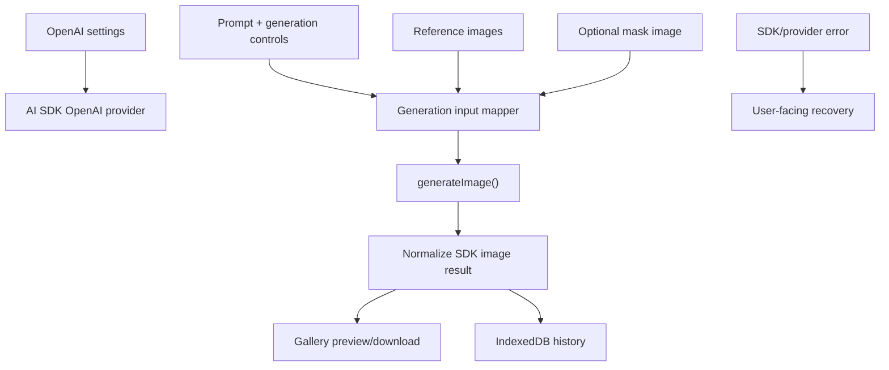

# refactor: Rebuild image workbench on OpenAI AI SDK

## Summary

把当前工作台从“第三方 OpenAI-compatible provider 调试/兼容工具”重构为“直接使用 OpenAI + AI SDK 的图片创作工作台”。新实现以 AI SDK `generateImage()` 为核心，覆盖文生图、图生图、多参考图组合和遮罩编辑，删除 provider discovery、baseURL、兼容回退、本地代理等旧架构负担。

---

## Problem Frame

当前实现围绕第三方兼容 provider 设计，包含模型发现、provider profiles、endpoint override、extra headers/query、responseMode fallback、本地代理等大量兼容逻辑。用户现在明确目标是直接使用 OpenAI，因此继续维护兼容层会让请求路径更复杂，也会让图生图、遮罩编辑这类 OpenAI 原生能力落地变慢。

---

## Assumptions

*This plan was authored without synchronous scope confirmation after the goal changed. The items below are agent inferences that should be reviewed before implementation proceeds.*

- 本次重构允许删除第三方 provider 多配置能力，只保留 OpenAI API key 和模型配置。
- API key 继续按当前产品定位存储在浏览器本地，不新增后端服务和云端密钥存储。
- 首版使用 AI SDK `generateImage()`，不引入 `generateText/streamText` 的 image_generation tool 或 Responses API 多轮 agent 流程。
- 图生图范围包含单图参考、多图参考组合和可选 mask 编辑，不实现画布级局部涂抹编辑器。

---

## Requirements

- R1. 使用 `ai` + `@ai-sdk/openai` 作为图片生成请求层，替换现有手写 OpenAI-compatible `fetch` 客户端。
- R2. 保留本地个人工作台体验：prompt、参数控制、生成结果预览、下载、历史、预设、结果复用为参考图。
- R3. 支持文生图：用户输入文本 prompt 后调用 OpenAI image model 生成一张或多张图片。
- R4. 支持图生图：用户上传一张或多张参考图，调用 AI SDK `generateImage()` 的 structured prompt image input。
- R5. 支持遮罩编辑：用户可上传源图和 mask，发送到 AI SDK 的 `mask` 参数；首版不提供内置 mask 绘制。
- R6. 支持 OpenAI 图片参数：model、size、count、quality、background、output format、output compression，并只发送有意义的配置。
- R7. 请求失败、超时、取消和参数不支持时，UI 必须给出明确状态和可执行恢复建议。
- R8. 删除旧 provider 兼容概念在 UI 和持久化里的主路径，避免用户误以为仍在配置第三方 provider。

---

## Scope Boundaries

- 不继续支持多个第三方 provider、模型发现、endpoint override、extra headers/query 或 provider-specific profile。
- 不实现生产后端、账号系统、云端密钥托管、多设备同步。
- 不实现画布级 mask 绘制、inpainting brush、图层系统或节点工作流。
- 不实现多轮聊天式图片 agent；Responses API image_generation tool 作为后续方向。
- 不在计划阶段运行 live OpenAI API；实现后若有有效 key 再做真实出图验证。

### Deferred to Follow-Up Work

- 后端 API route 代理和服务端密钥管理：如果之后要部署给多人使用，再单独设计。
- 内置 mask 绘制器：首版先支持上传 mask 文件，避免把重构扩大成图像编辑器。
- Responses API 多轮图片工作流：适合后续做“基于上一次结果继续修改”的对话式体验。

---

## Context & Research

### Relevant Code and Patterns

- `src/app/App.tsx` 目前是集成中心，负责 provider、生成、历史、预设、结果复用、toast 和错误状态。
- `src/features/workbench/generation-form.tsx`、`src/features/workbench/reference-image-dropzone.tsx`、`src/features/workbench/generation-controls.tsx` 已有 prompt、参考图、尺寸、张数、质量和格式 UI，可复用交互骨架。
- `src/lib/openai/openai-compatible-client.ts`、`src/lib/openai/image-request-builder.ts`、`src/lib/openai/model-discovery.ts`、`src/lib/openai/provider-profile.ts` 是旧兼容层，应被新的 SDK client 替代。
- `src/features/providers/*` 是 provider 配置 UI；重构后应收敛为 OpenAI settings，而不是继续展示兼容回退。
- `src/lib/storage/local-config-store.ts` 目前存 provider/presets；需要迁移为 OpenAI settings + presets。
- 用户提供的 SDK 示例证明 `createOpenAI()` + `generateImage()` 可以用 `providerOptions.openai` 承载 `quality`、`output_format`、`output_compression`、`background`、`moderation` 等 OpenAI 参数。

### Institutional Learnings

- 旧 OpenAI-compatible learning 的关键经验是“兼容 provider 的请求参数会漂移”。新方向直接使用 OpenAI 和 AI SDK 后，这类 provider-specific workaround 应删除，而不是继续影响默认体验。

### External References

- AI SDK `generateImage()` 支持 `model`、`prompt`、`n`、`size`、`providerOptions`、`maxRetries`、`abortSignal`、`headers`，并支持 prompt 里传 `images` 和 `mask`。
- AI SDK image generation 文档说明 provider-specific options 会作为 provider 请求体属性传入，适合承载 OpenAI 图片参数。
- AI SDK OpenAI provider 文档展示了 `gpt-image-1` 的图生图、多图组合和 mask 编辑用法，并说明 `providerMetadata.openai.images` 可包含 revised prompt、size、quality、background、output format 等元数据。
- OpenAI 图片文档说明 `gpt-image-1` 是多模态图片模型，支持 text/image input 和 image output，并有 image generation 与 image edit 端点；当前模型列表还显示更新的 GPT Image 系列，但具体 SDK 支持应以实现时依赖版本为准。

---

## Key Technical Decisions

- 使用 AI SDK 作为唯一请求层：删除手写 Image API fetch builder，避免同时维护两套请求契约。
- OpenAI settings 取代 provider settings：配置只保留 API key、模型、默认参数和可选请求超时，不再暴露 `baseURL` 和兼容 fallback。
- 默认模型先用 `gpt-image-1`，并把模型字段做成可编辑输入/select：这样符合 AI SDK OpenAI provider 文档里的稳定示例，同时给后续 `gpt-image-1.5`、`gpt-image-2` 留出升级空间。
- 图生图用 structured prompt：文本 prompt 和参考图数组作为同一个 generation request 的输入，不再走旧 `images/edits` multipart builder。
- 遮罩编辑用上传 mask 文件：首版只要求用户提供 mask，不在 UI 内绘制，避免把架构重构扩大成编辑器项目。
- 结果存储继续用 IndexedDB：AI SDK 返回 `uint8Array/base64` 后统一转成 data URL 或 Blob 存入现有 history 结构，保留当前预览/下载能力。
- 旧本地配置要做温和迁移：读取到旧 provider store 时不报错，可提示用户重新填写 OpenAI API key；不尝试自动迁移第三方 baseURL。

---

## Open Questions

### Resolved During Planning

- 是否继续保留 OpenAI-compatible provider 能力：不保留在主路径。用户目标已改为直接 OpenAI，兼容层删除能显著降低复杂度。
- 是否使用 SDK 而不是手写 fetch：使用 SDK。AI SDK 已覆盖文生图、图生图、多图输入、mask、provider options、重试和 abort signal。
- 是否实现内置 mask 绘制器：不纳入首版重构。先支持 mask 文件上传。

### Deferred to Implementation

- 当前安装的 AI SDK 版本是否完整支持最新 `gpt-image-2`：实现时安装后以 TypeScript 类型和最小调用测试确认，默认模型可先落在文档示例稳定支持的 `gpt-image-1`。
- SDK 返回图片对象的具体 mediaType/providerMetadata 字段：实现时按类型定义和单测 fixture 确认。
- 旧 localStorage provider 数据如何提示用户：实现时选择一次性 toast 或 settings 面板提示，不阻断主流程。

---

## Output Structure

    src/lib/openai/
      ai-sdk-image-client.ts
      ai-sdk-image-client.test.ts
      openai-settings-store.ts
      openai-settings-store.test.ts
    src/features/settings/
      openai-settings-panel.tsx
      openai-settings-panel.test.tsx
    src/features/workbench/
      generation-form.tsx
      reference-image-dropzone.tsx
      mask-image-dropzone.tsx
      generation-controls.tsx

---

## High-Level Technical Design

> *This illustrates the intended approach and is directional guidance for review, not implementation specification. The implementing agent should treat it as context, not code to reproduce.*

核心形态是“UI state -> SDK input mapper -> `generateImage()` -> normalized result”。旧代码里 provider discovery、request URL 拼接、response envelope 猜测、fallback profile 都从主路径移除。

---

## Implementation Units

- U1. **Add AI SDK dependencies and client wrapper**

**Goal:** 引入 `ai`、`@ai-sdk/openai`，新增单一 OpenAI image client，封装 `generateImage()`、超时、取消、错误归一化和结果归一化。

**Requirements:** R1, R3, R6, R7

**Dependencies:** None

**Files:**
- Modify: `package.json`
- Modify: `pnpm-lock.yaml`
- Create: `src/lib/openai/ai-sdk-image-client.ts`
- Create: `src/lib/openai/ai-sdk-image-client.test.ts`
- Modify: `src/lib/openai/response-normalizer.ts`
- Modify: `src/lib/openai/response-normalizer.test.ts`

**Approach:**
- 用 `createOpenAI()` 创建 OpenAI provider，API key 从 settings 传入。
- client 接收统一 generation input，内部决定 prompt 是纯文本还是 `{ text, images }`。
- `providerOptions.openai` 只放 OpenAI 专属图片参数，如 quality、background、output_format、output_compression、moderation。
- 用 `AbortController` 支持超时/取消；错误统一成 UI 友好的 message/detail/recommendation。

**Execution note:** 先用 mocked `generateImage()` 建 client contract tests，再替换 App 调用。

**Patterns to follow:**
- 现有 `src/lib/openai/openai-compatible-client.ts` 的 `ClientResult` 成功/失败 union。
- 用户提供的 SDK 示例里的 `removeUndefined` 参数过滤思路。

**Test scenarios:**
- Happy path: 文生图输入会调用 SDK image model，并把返回 `uint8Array/base64` 归一成 `ResultImage` 可用数据。
- Happy path: OpenAI provider options 只包含用户选择的非空参数。
- Error path: SDK 抛出认证错误时返回“检查 OpenAI API key”的建议和 detail。
- Error path: abort signal 触发时返回“请求已取消或超时”的状态，不写入结果。
- Edge case: `count=1`、`quality=auto`、`outputFormat=auto` 时不发送无意义 provider options。

**Verification:**
- client 单测证明 SDK 输入映射、provider options、错误归一化和图片结果归一化都可控。

---

- U2. **Replace provider settings with OpenAI settings**

**Goal:** 删除多 provider 管理和兼容 fallback UI，改为 OpenAI API key、模型和默认参数配置。

**Requirements:** R1, R2, R8

**Dependencies:** U1

**Files:**
- Create: `src/features/settings/openai-settings-panel.tsx`
- Create: `src/features/settings/openai-settings-panel.test.tsx`
- Create: `src/lib/openai/openai-settings-store.ts`
- Create: `src/lib/openai/openai-settings-store.test.ts`
- Modify: `src/app/App.tsx`
- Modify: `src/lib/storage/local-config-store.ts`
- Delete: `src/features/providers/provider-settings-panel.tsx`
- Delete: `src/features/providers/provider-form.tsx`
- Delete: `src/features/providers/provider-list.tsx`
- Delete: `src/features/providers/model-selector.tsx`
- Delete: `src/features/providers/compatibility-fallback-panel.tsx`

**Approach:**
- Settings panel 只保留 OpenAI API key、model、默认 size/quality/format/background/compression、请求超时。
- API key 仍存在浏览器本地，并明确标注本地个人使用。
- 读取旧 provider store 时不崩溃；显示一次性提示，让用户填写 OpenAI API key。
- App 状态从 `ProviderConfig` 转为 `OpenAISettings`，历史和预设里保留 modelId 但不再绑定 providerId。

**Patterns to follow:**
- 现有 provider settings panel 的次级配置布局。
- `src/lib/storage/local-config-store.ts` 的 localStorage 读写边界。

**Test scenarios:**
- Happy path: 用户填写 API key 和模型后保存，刷新页面可恢复 settings。
- Edge case: localStorage 里存在旧 provider store 时，新 settings store 返回默认配置并提示重新配置。
- Edge case: 空 API key 时生成按钮不可用，并展示明确字段错误。
- Integration: App 不再渲染 provider list、model discovery 或 compatibility fallback。

**Verification:**
- Settings 单测和 App 测试证明旧 provider UI 已从主路径移除，新 OpenAI settings 可保存和恢复。

---

- U3. **Rebuild generation form for text, reference, and mask modes**

**Goal:** 把当前 text/reference 二态表单扩展为 OpenAI 图片工作流：文生图、图生图、多参考图、遮罩编辑。

**Requirements:** R2, R3, R4, R5, R6

**Dependencies:** U1, U2

**Files:**
- Modify: `src/features/workbench/generation-form.tsx`
- Modify: `src/features/workbench/generation-form.test.tsx`
- Modify: `src/features/workbench/reference-image-dropzone.tsx`
- Create: `src/features/workbench/mask-image-dropzone.tsx`
- Modify: `src/features/workbench/generation-controls.tsx`
- Modify: `src/features/workbench/prompt-editor.tsx`
- Modify: `src/features/history/history-types.ts`
- Modify: `src/features/presets/preset-store.ts`
- Modify: `src/features/presets/preset-store.test.ts`

**Approach:**
- Generation mode 使用 `text`、`image`、`mask` 三类明确状态。
- 参考图支持数组，首版限制最多 16 张，贴合 AI SDK OpenAI provider 文档对 `gpt-image-1` 多图输入的说明。
- mask 模式要求至少一张源图和一张 mask 图；UI 不绘制 mask，只上传。
- 控件新增 background、output compression，并让 unsupported/auto 值不进入 provider options。
- 历史和预设记录 mode、model、核心参数和参考图摘要，不把本地 File 对象直接持久化。

**Patterns to follow:**
- `src/features/workbench/reference-image-dropzone.tsx` 现有上传/预览/清理模式。
- `src/features/results/result-card.tsx` 的“用作参考图”复用入口。

**Test scenarios:**
- Happy path: 文生图模式只需要 prompt 和 settings 即可生成。
- Happy path: 图生图模式上传一张参考图后，生成请求包含 text prompt 和 images。
- Happy path: 多参考图模式上传多张图后，生成请求包含所有参考图且 UI 显示数量。
- Happy path: mask 模式上传源图和 mask 后，生成请求包含 images 和 mask。
- Edge case: 图生图没有参考图时生成按钮禁用或阻止提交。
- Edge case: mask 模式缺源图或缺 mask 时阻止提交并给出具体提示。
- Edge case: 超过参考图数量上限时拒绝新增并提示。
- Integration: 结果图点击“用作参考图”后进入图生图模式，并把该结果转成 reference file。

**Verification:**
- 表单测试覆盖三种 mode、上传约束、按钮可用性和提交 payload。

---

- U4. **Wire App to the SDK client and preserve creative workflow**

**Goal:** 让 App 使用新的 SDK client 完成生成，同时保留结果画廊、历史、预设、预览、下载、复用参考图。

**Requirements:** R2, R3, R4, R5, R7

**Dependencies:** U1, U2, U3

**Files:**
- Modify: `src/app/App.tsx`
- Modify: `src/app/App.test.tsx`
- Modify: `src/features/results/result-gallery.tsx`
- Modify: `src/features/results/result-card.tsx`
- Modify: `src/features/history/history-panel.tsx`
- Modify: `src/features/history/history-store.test.ts`
- Modify: `src/lib/storage/indexeddb-history-store.ts`
- Modify: `src/lib/storage/indexeddb-history-store.test.ts`

**Approach:**
- `runGeneration` 从 `generateImages(provider, input)` 改为 `generateOpenAIImages(settings, form)`。
- history entry 不再引用 providerId/providerLabel，改为 OpenAI model 和 generation mode。
- 保留“结果复用为参考图”，并支持把多张历史结果加入当前参考图列表。
- loading 文案改为 OpenAI 请求语境；错误详情保留 SDK detail 和 provider metadata。

**Patterns to follow:**
- `src/app/App.tsx` 现有 `runGeneration`、`handleReuseImageAsReference`、history 写入流程。
- `src/features/results/download-image.ts` 现有 data URL 下载逻辑。

**Test scenarios:**
- Happy path: 配置 API key 后文生图成功，结果进入 gallery 和 history。
- Happy path: 图生图成功后 history 标记为图生图，并能继续复用结果。
- Happy path: mask 编辑成功后 gallery 正常预览和下载。
- Error path: SDK 返回认证/配额/参数错误时，App 展示错误卡片和 detail。
- Edge case: 用户生成中点击取消，loading 结束且不写入空 history。
- Integration: preset apply 后可以重新生成，不依赖旧 providerId。

**Verification:**
- App 测试证明三种 mode 能走到 SDK client；历史、预设、结果复用仍可用。

---

- U5. **Remove old OpenAI-compatible infrastructure**

**Goal:** 清理旧 provider discovery、request builder、local proxy、profile、fallback 和相关测试，避免新架构存在两套请求路径。

**Requirements:** R1, R8

**Dependencies:** U1, U2, U4

**Files:**
- Delete: `src/lib/openai/openai-compatible-client.ts`
- Delete: `src/lib/openai/openai-compatible-client.test.ts`
- Delete: `src/lib/openai/image-request-builder.ts`
- Delete: `src/lib/openai/image-request-builder.test.ts`
- Delete: `src/lib/openai/model-discovery.ts`
- Delete: `src/lib/openai/model-discovery.test.ts`
- Delete: `src/lib/openai/provider-profile.ts`
- Delete: `src/lib/openai/provider-profile.test.ts`
- Delete: `src/lib/openai/provider-capabilities.ts`
- Delete: `src/lib/openai/local-proxy.ts`
- Delete: `src/lib/openai/local-proxy.test.ts`
- Delete: `src/features/providers/provider-store.ts`
- Delete: `src/features/providers/provider-store.test.ts`
- Modify: `vite.config.ts`

**Approach:**
- 先确认没有 import 依赖后再删除文件。
- `vite.config.ts` 移除只服务旧 provider CORS 的本地代理逻辑。
- 保留 `src/lib/openai/response-normalizer.ts` 只有在新 SDK result normalization 仍复用时才保留；否则合并进 `ai-sdk-image-client.ts`。

**Patterns to follow:**
- 删除旧兼容代码时同步删测试，避免误导后续维护者继续修 provider fallback。

**Test scenarios:**
- Test expectation: none -- 这是架构清理单元，行为由 U1-U4 的替代测试覆盖。

**Verification:**
- `rg` 不再能找到 provider discovery、compatibility fallback、provider-specific profile、本地代理 import。

---

- U6. **Refresh copy, docs, and e2e coverage**

**Goal:** 把产品文案和测试从 OpenAI-compatible provider 工作台改成 OpenAI 图片创作工作台，并补齐关键浏览器流程验证。

**Requirements:** R2, R7, R8

**Dependencies:** U1, U2, U3, U4, U5

**Files:**
- Modify: `README.md`
- Modify: `index.html`
- Modify: `src/components/layout/app-shell.tsx`
- Modify: `tests/e2e/workbench.spec.ts`
- Modify: `tests/e2e/history-and-presets.spec.ts`
- Refresh or archive provider-specific solution docs so they no longer mention concrete private baseURL values.

**Approach:**
- README 改成 OpenAI API key、AI SDK、文生图、图生图、mask 上传说明。
- 页面标题和 masthead 文案删除 OpenAI-compatible/provider/fallback 语义。
- E2E 用 mocked SDK/client 或 network boundary 验证 UI 流程，不依赖 live OpenAI。
- OpenAI-compatible provider learning 不再作为当前架构说明；如果保留，应标记为 legacy provider 方向，并避免写入具体私有 baseURL。

**Patterns to follow:**
- 现有 e2e 覆盖工作台生成、历史和预设的方式。

**Test scenarios:**
- Happy path: 用户配置 OpenAI key、输入 prompt、生成 mocked 图片、预览和下载按钮可见。
- Happy path: 用户上传参考图后生成，结果可作为下一轮参考图。
- Happy path: 用户上传源图和 mask 后可以提交 mask mode。
- Edge case: 无 API key 时引导用户到 OpenAI settings，而不是 provider setup。
- Error path: mocked SDK error 会展示明确失败状态和详情入口。

**Verification:**
- 单测和 e2e 都不再引用旧 provider 文案；README 能指导用户用 OpenAI key 启动工作台。

---

## System-Wide Impact

- **Interaction graph:** App 仍是集成中心，但从 provider/discovery/fallback 图变成 settings/form/sdk/history 图。
- **Error propagation:** SDK errors 统一进 client failure，App 只处理 normalized success/failure，不直接理解 SDK exception shape。
- **State lifecycle risks:** localStorage schema 会变化；必须兼容旧 provider 数据，避免应用启动崩溃。
- **API surface parity:** 文生图、图生图、mask 模式都应使用同一个 SDK client 和 result normalizer。
- **Integration coverage:** 需要覆盖 settings -> form -> SDK client -> gallery/history 的跨层流程。
- **Unchanged invariants:** 图片结果仍可预览、下载、沉淀历史、保存预设和复用为参考图。

---

## Risks & Dependencies

| Risk | Mitigation |
|------|------------|
| AI SDK 版本与最新 OpenAI image model 支持不完全一致 | 先以文档示例 `gpt-image-1` 为默认模型，保留模型输入；实现时用 TypeScript 类型和 mocked tests 确认 |
| 删除 provider 代码影响旧用户配置 | 新 settings store 对旧数据温和降级，提示重新填写 OpenAI key |
| 浏览器本地保存 API key 不适合公开部署 | README 和 UI 明确“本地个人使用”；多人部署另开后端代理计划 |
| mask 编辑被误解为内置绘图 | UI 文案明确“上传 mask 文件”，不承诺画布绘制 |
| live OpenAI 调用受 key、额度、网络影响 | 自动化测试 mock SDK client；真实出图作为手工验证，不作为单测前提 |
| 大图片 data URL 增大 IndexedDB 压力 | 保留历史数量/容量限制，必要时沿用现有 retention 逻辑 |

---

## Documentation / Operational Notes

- 实现阶段需要安装依赖：`ai`、`@ai-sdk/openai`。这是包管理变更，执行前应确认或由 `/ce-work` 在明确任务上下文中处理。
- 实现后至少运行 TypeScript build、Vitest 和相关 Playwright e2e。
- 若有可用 OpenAI API key，最后再做一次手工 live 验证：文生图、图生图、mask 上传各一条。

---

## Sources & References

- Related code: `src/app/App.tsx`
- Related code: `src/features/workbench/generation-form.tsx`
- Related code: `src/lib/openai/openai-compatible-client.ts`
- Related code: `src/features/providers/provider-settings-panel.tsx`
- External docs: [AI SDK generateImage](https://ai-sdk.dev/docs/reference/ai-sdk-core/generate-image)
- External docs: [AI SDK Image Generation](https://ai-sdk.dev/docs/ai-sdk-core/image-generation)
- External docs: [AI SDK OpenAI Provider](https://ai-sdk.dev/docs/guides/providers/openai)
- External docs: [OpenAI GPT Image 1 model](https://developers.openai.com/api/docs/models/gpt-image-1)
