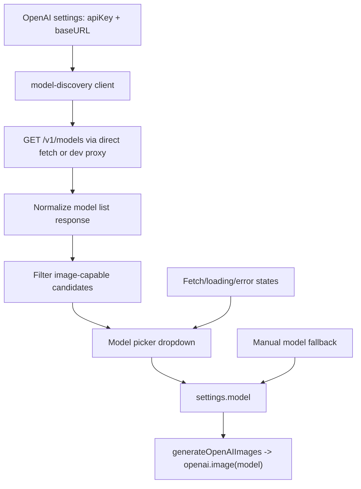

# refactor: Model picker and studio layout

## Summary

把 TokenCanvas 的模型输入、参数下拉和整体布局升级成更直接的创作 studio：模型从当前 OpenAI provider 拉取并过滤图片模型，参数控件改成项目内自定义 dropdown，页面允许破坏性重排为“模型/设置控制条 + 创作控制台 + 结果画布 + 资产抽屉”的操作型体验。

---

## Problem Frame

当前页面已经完成第一轮 composer-first 重构，但模型仍是手写文本框，多个参数仍使用浏览器默认 `<select>`，视觉和交互质感不一致。用户这次明确允许破坏性重构页面样式和布局，因此计划应优先服务“打开页面即可选择可用图片模型并开始生成”的操作效率，而不是维持上一版区域结构。

---

## Assumptions

*This plan is authored without a separate confirmation round because the user explicitly named the desired interactions and allowed destructive page/layout refactoring. The items below are agent inferences that should be reviewed before implementation.*

- “基于 provider 拉取模型”在当前 direct OpenAI 架构中解释为：基于 `OpenAISettings.apiKey` + `OpenAISettings.baseURL` 请求当前配置端点的 models list。
- 官方 OpenAI `/v1/models` list 只返回基础模型对象，不返回完整 modality 字段；图片模型过滤需要结合本地规则和官方图片模型目录，而不是假设接口直接给能力标签。
- 本次仍不新增 Tailwind、Radix、Phosphor 或 Framer Motion；自定义 dropdown 用 React + 全局 CSS 实现。
- 允许重排页面和组件结构，但不改 AI SDK `generateImage()` 请求映射、IndexedDB 历史结构和预设数据语义。

---

## Requirements

- R1. OpenAI 设置区必须提供“拉取模型”动作，使用当前 API key/baseURL 获取模型列表。
- R2. 模型列表必须过滤为图片生成/编辑相关模型，优先展示当前可用的 GPT Image 模型，并保留手动输入兜底。
- R3. 模型拉取必须有 loading、empty、error、unauthorized、CORS/dev proxy 等明确状态和恢复动作。
- R4. 生成模型选择必须从文本框升级为可搜索/可键盘操作的 dropdown 或 combobox，不依赖浏览器默认 select 外观。
- R5. 尺寸、张数、质量、格式、背景等参数下拉必须统一成高质量自定义控件，支持 disabled、focus、active、error/提示状态。
- R6. 页面布局可以破坏性重构，但第一屏必须优先服务：选择模型、写 prompt、附素材、生成、查看结果。
- R7. 设置、历史、预设不能抢占主操作空间，应作为可访问但次要的资产/配置区域。
- R8. 移动端必须保持严格单列或抽屉式操作，不出现横向溢出；自定义 dropdown 在移动端不能被视口裁切。
- R9. 现有单元测试、e2e 和视觉验证必须覆盖模型发现、图片模型过滤、自定义 dropdown 和新主布局。

---

## Scope Boundaries

- 不改 OpenAI 图片生成请求的 `generateOpenAIImages()` 主契约。
- 不新增后端服务；本地开发环境继续复用现有 dev proxy 处理非官方 baseURL 的 CORS 场景。
- 不自动调用真实生成接口验证模型；只拉取 models list 和 UI 选择。
- 不删除手动模型输入兜底，避免模型列表接口不可用时阻断用户。
- 不引入第三方 UI 组件库或图标库；如果后续要上 Radix/Phosphor，另开计划。

### Deferred to Follow-Up Work

- 基于官方 model detail 页面自动同步能力矩阵：当前先用本地 image-model matcher 和固定目录兜底。
- 模型能力驱动参数裁剪：本计划只保证下拉样式和模型选择，具体参数是否随模型动态隐藏可后续扩展。
- Responses API 多轮图片工具模型选择：当前仍围绕 Image API / AI SDK image model 主路径。

---

## Context & Research

### Relevant Code and Patterns

- `src/lib/openai/openai-settings-store.ts` 保存 `apiKey`、`baseURL`、`model` 和默认参数，是模型发现状态最自然的持久化边界。
- `src/lib/openai/ai-sdk-image-client.ts` 使用 `createOpenAI({ apiKey, baseURL, fetch })` 并调用 `openai.image(settings.model)`；模型发现不应塞进这个生成 client。
- `src/lib/openai/openai-dev-proxy.ts` 已支持本地通过 `/api/openai` 转发到自定义 `baseURL`，模型列表可复用相同 proxy 判断，避免本地兼容端点 CORS 失败。
- `src/features/settings/openai-settings-panel.tsx` 当前模型为文本输入，适合替换为 model picker + 手动输入兜底。
- `src/features/workbench/generation-controls.tsx` 当前尺寸、张数、质量、格式、背景仍是原生 `<select>`，是自定义 dropdown 的主要迁移点。
- `src/styles/tokens.css` 和 `src/styles/global.css` 已在上一轮切到 `Geist`、中性灰、低饱和青绿和 composer-first，但用户允许再次破坏性重排。
- `src/app/App.tsx` 组装 settings、composer、gallery、history、presets，是 studio layout 重排入口。

### Institutional Learnings

- 记忆和现有计划均确认本仓库方向是 direct OpenAI + AI SDK image workbench；模型发现要服务 OpenAI 图片创作，而不是回到旧的多 provider compatibility console。

### External References

- OpenAI Models API: `GET /v1/models` 返回 `data` 数组，模型对象包含 `id`、`created`、`object`、`owned_by`，`id` 可用于 API endpoints。
- OpenAI Image generation guide: GPT Image models 包括 `gpt-image-2`、`gpt-image-1.5`、`gpt-image-1`、`gpt-image-1-mini`，并支持生成/编辑图片；官方还说明输出可调整 quality、size、format、compression。
- OpenAI GPT Image 2 model page: `gpt-image-2` 输入支持 text/image，输出 image，并支持 image generation 和 image edit endpoints。

---

## Key Technical Decisions

- 新增 model discovery client，而不是扩展 generation client：`src/lib/openai/model-discovery.ts` 只负责 `/models` 拉取、错误归一化和图片模型过滤。
- 图片模型过滤采用双层策略：先以官方 GPT Image/DALL-E/catalog matcher 识别 `gpt-image-*`、`chatgpt-image-*`、`dall-e-*` 等；再把当前已保存模型保留为“手动/当前模型”选项，避免 API list 不完整时丢失可用配置。
- dropdown 做成 shared headless component：用按钮 + listbox + roving active option 管理交互，外观由 CSS 控制；所有参数选择复用同一组件。
- Studio layout 允许重排：顶部是 provider/model command bar，左侧是 prompt/assets controls，右侧是 result stage，settings/history/presets 合并成下方或侧边 asset dock。
- 模型发现请求不自动保存：用户选择模型或手动输入后才更新 settings；“拉取成功”只刷新候选列表。
- API key 不进入错误 detail：模型 discovery 的错误归一化必须沿用现有 redact 思路，禁止把 key 写入 toast、detail 或测试快照。

---

## Open Questions

### Resolved During Planning

- 模型列表是否能直接判断 modality：不能依赖。官方 list 返回基础模型对象，图片能力需要本地过滤规则和官方图片模型目录兜底。
- 是否保留手动输入：保留。它用于支持尚未进入本地 matcher 的新模型或兼容端点模型。
- 是否美化原生 `<select>` 即可：不够。用户明确反馈默认样式差，计划改为自定义 dropdown/listbox。

### Deferred to Implementation

- 官方 OpenAI CORS 是否允许浏览器直接 `GET /v1/models`：实现时用当前环境验证；如果官方接口也有 CORS 限制，就通过现有 Vite dev proxy 或统一 fetch strategy 处理。
- 自定义 dropdown 是否需要 portal：实现时按截图验证决定。若普通绝对定位在 rail/stage 内被裁切，再加轻量 portal 到 document body。
- 模型 matcher 初始 allowlist 具体顺序：实现时以官方图片模型目录和当前依赖支持情况排序，默认推荐 `gpt-image-2` 或当前可用列表中最新 GPT Image。

---

## High-Level Technical Design

> *This illustrates the intended approach and is directional guidance for review, not implementation specification. The implementing agent should treat it as context, not code to reproduce.*

---

## Implementation Units

- U1. **Add OpenAI model discovery and image filtering**

**Goal:** 支持基于当前 OpenAI settings 拉取模型列表，并过滤出图片相关候选。

**Requirements:** R1, R2, R3

**Dependencies:** None

**Files:**
- Create: `src/lib/openai/model-discovery.ts`
- Create: `src/lib/openai/model-discovery.test.ts`
- Modify: `src/lib/openai/openai-settings-store.ts`
- Modify: `src/lib/openai/openai-settings-store.test.ts`
- Modify: `src/lib/openai/openai-dev-proxy.ts`
- Modify: `src/lib/openai/openai-dev-proxy.test.ts`

**Approach:**
- 新建 `fetchOpenAIModels(settings)` 类型边界，返回 success/failure union，错误结构对齐 existing client result 风格。
- 请求 URL 使用当前 `baseURL` 拼 `/models`，本地自定义 baseURL 复用 dev proxy fetch 策略。
- 解析 OpenAI list response，只信任 `id`、`created`、`owned_by` 等基础字段。
- `isImageModelId()` 用官方图片模型目录和稳定命名模式过滤；保留 DALL-E deprecated 模型但标记为 legacy，默认排序落后于 GPT Image。
- 当前保存模型如果未出现在结果里，追加为 manual/current option。

**Execution note:** 先写模型过滤和错误归一化单测，再接 UI。

**Patterns to follow:**
- `src/lib/openai/ai-sdk-image-client.ts` 的 success/failure union 和 sensitive detail redaction。
- `src/lib/openai/openai-dev-proxy.ts` 的 baseURL 安全校验。

**Test scenarios:**
- Happy path: `/models` 返回 `gpt-image-2`、`gpt-5.5`、`text-embedding-*` 时，只把图片模型放入 primary candidates。
- Happy path: 返回 `dall-e-3` 时候选存在但带 legacy/deprecated 标记。
- Edge case: 当前 settings model 不在 `/models` 返回中，候选列表仍包含该模型作为 manual/current。
- Error path: 401 返回“检查 OpenAI API key”的建议，不泄露 key。
- Error path: fetch/CORS 失败时提示检查 baseURL/dev proxy，不覆盖当前模型。

**Verification:**
- 模型 discovery 单测覆盖列表解析、过滤、排序、兜底和错误归一化。

---

- U2. **Replace model text input with a model picker**

**Goal:** OpenAI 设置区从文本模型输入升级为可拉取、可选择、可手动兜底的模型选择体验。

**Requirements:** R1, R2, R3, R4

**Dependencies:** U1

**Files:**
- Modify: `src/app/App.tsx`
- Modify: `src/features/settings/openai-settings-panel.tsx`
- Modify: `src/features/settings/openai-settings-panel.test.tsx`
- Create: `src/features/settings/model-picker.tsx`
- Create: `src/features/settings/model-picker.test.tsx`
- Modify: `src/styles/global.css`

**Approach:**
- `App` 持有 model discovery 状态：idle/loading/success/error，并把候选模型传给 settings panel。
- Settings panel 增加“拉取模型”按钮，禁用条件为缺少 API key 或正在 loading。
- Model picker 显示当前模型、候选数量、legacy 标记、last fetched 文案。
- 选择候选模型只更新 settings，不自动保存；用户仍通过保存按钮落盘。
- 提供“手动输入模型”折叠或 inline fallback，不因列表失败阻断生成。

**Patterns to follow:**
- `OpenAISettingsPanel` 的受控输入模式。
- `App` 当前 toast/error 状态传递模式。

**Test scenarios:**
- Happy path: 点击“拉取模型”后 loading 状态出现，成功后候选模型可选。
- Happy path: 选择 `gpt-image-2` 会调用 `onChange` 更新 settings.model。
- Edge case: 缺 API key 时拉取按钮不可用，并提示先填写 key。
- Error path: discovery 失败时显示 inline error，原 settings.model 不变。
- Integration: App 中模型选择更新后 masthead/current model label 同步显示。

**Verification:**
- 用户不用记模型 ID，也可以从当前 provider 返回的图片模型里选择；失败时仍能手动输入。

---

- U3. **Build shared custom dropdown controls**

**Goal:** 替换默认浏览器 `<select>` 外观，统一模型和参数下拉的视觉、键盘和移动端体验。

**Requirements:** R4, R5, R8

**Dependencies:** None

**Files:**
- Create: `src/components/form/dropdown-field.tsx`
- Create: `src/components/form/dropdown-field.test.tsx`
- Modify: `src/features/workbench/generation-controls.tsx`
- Modify: `src/features/settings/openai-settings-panel.tsx`
- Modify: `src/features/workbench/generation-form.test.tsx`
- Modify: `src/styles/global.css`

**Approach:**
- 使用 button + listbox 实现 headless dropdown，保留 hidden input 或明确 aria 属性供测试和可访问性使用。
- 支持键盘打开、上下移动、Enter/Space 选择、Escape 关闭、Blur 关闭。
- 使用同一组件渲染 size/count/quality/format/background；数字值在上层转换。
- 移动端 dropdown 面板宽度贴合触发器并限制 max-height，必要时滚动。
- 保留原生 `<input type="number">` 用于 compression，因为它是范围输入而不是离散下拉。

**Execution note:** 先用 RTL/user-event 覆盖键盘交互，再替换 generation controls。

**Patterns to follow:**
- 当前 `.field` label-above-input 结构和 focus ring。
- `design-taste-frontend` 对 active feedback、focus、loading/disabled 状态的要求。

**Test scenarios:**
- Happy path: 点击 dropdown 后展示选项，选择后调用 `onChange` 并关闭面板。
- Happy path: 键盘 ArrowDown/Enter 可选择选项。
- Edge case: disabled dropdown 不打开、不触发 onChange。
- Edge case: 选项过多时面板可滚动且不会改变页面布局高度。
- Integration: `GenerationControls` 的 size/count/quality/format/background 更新仍能修改表单状态。

**Verification:**
- 所有离散参数不再显示浏览器默认 select UI，键盘和移动端可用。

---

- U4. **Destructively refactor the studio layout**

**Goal:** 在不改变生成/历史/预设数据契约的前提下，重排页面为更适合图片创作的 studio 操作界面。

**Requirements:** R6, R7, R8, R9

**Dependencies:** U2, U3

**Files:**
- Modify: `src/app/App.tsx`
- Modify: `src/components/layout/app-shell.tsx`
- Modify: `src/components/layout/workbench-frame.tsx`
- Modify: `src/features/workbench/generation-form.tsx`
- Modify: `src/features/results/result-gallery.tsx`
- Modify: `src/features/history/history-panel.tsx`
- Modify: `src/features/presets/preset-panel.tsx`
- Modify: `src/styles/global.css`
- Modify: `src/styles/tokens.css`
- Modify: `src/app/App.test.tsx`
- Modify: `tests/e2e/workbench.spec.ts`
- Modify: `tests/e2e/history-and-presets.spec.ts`

**Approach:**
- 将 provider/model/status 做成顶部 command bar，不再埋在设置卡片里。
- 主区分为左侧 prompt/assets control deck 和右侧 result stage；结果 stage 空状态更像画布，不再像说明卡。
- OpenAI settings、history、presets 作为 secondary asset dock，桌面端横向/抽屉式区域，移动端在主流程之后单列。
- 删除上一轮仍残留的过多 card borders，使用分隔线、背景带和少量 elevation 表达层级。
- 所有交互控件保留明确 hover/active/focus，不使用外部动效库。

**Patterns to follow:**
- `WorkbenchFrame` 的插槽边界，但允许重命名/重排插槽以匹配 studio。
- 现有 HistoryPanel/PresetPanel 的事件回调和数据展示。

**Test scenarios:**
- Happy path: 首屏语义顺序包含模型选择、prompt、生成按钮、结果 stage。
- Happy path: 历史和预设仍可应用到创作表单。
- Empty state: 新 result stage 空状态指向“选模型 + 写 prompt + 生成”的操作路径。
- Responsive: 390px 移动视口下无横向溢出，自定义 dropdown 不被裁切。

**Verification:**
- 桌面截图中主操作路径一屏内闭环；移动截图保持严格单列；历史/预设功能未回退。

---

- U5. **Full verification and visual regression pass**

**Goal:** 用测试、构建、e2e 和浏览器截图验证模型发现、dropdown 和破坏性布局重构。

**Requirements:** R3, R8, R9

**Dependencies:** U1, U2, U3, U4

**Files:**
- Modify: `tests/e2e/workbench.spec.ts`
- Modify: `tests/e2e/history-and-presets.spec.ts`
- Modify: `src/test/setup.ts` *(only if dropdown tests need shared DOM helpers)*

**Approach:**
- 单元测试覆盖 discovery、picker、dropdown、settings panel、generation controls。
- e2e 覆盖页面首屏、模型 picker 可见、参数 dropdown 可打开、历史/预设仍存在。
- 使用 Playwright 截桌面和移动图，检查 scrollWidth/clientWidth、重叠、裁切和默认 select 残留。
- 做 CSS 搜索，确认主路径不再出现默认 select 样式依赖和旧 provider console 命名。

**Test scenarios:**
- Integration: mock `/models` 后 UI 能展示并选择图片模型。
- Integration: 所有离散参数 dropdown 可以通过点击选择。
- Error path: `/models` 失败时页面仍可手动设置模型并生成。
- Visual: 桌面和移动截图无横向溢出、文字溢出、dropdown 裁切或大面积空白。

**Verification:**
- `pnpm test`、`pnpm build`、`pnpm test:e2e` 通过；截图和 CSS 搜索证明默认 select/旧布局问题已收敛。

---

## System-Wide Impact

- **Interaction graph:** 模型 discovery 从 settings 出发，只更新 settings.model；生成链路仍从 `App` 调用 `generateOpenAIImages(settings, form)`。
- **Error propagation:** discovery 错误应显示在 settings/model picker 附近，并可同步 toast；不得污染 generationError。
- **State lifecycle risks:** discovery 候选列表是 UI state，不进入 localStorage；只有用户保存 settings 才持久化模型。
- **API surface parity:** 现有手动模型输入能力保留，兼容未知新模型和兼容端点模型。
- **Integration coverage:** 模型选择、生成参数 dropdown、history/preset apply 都要通过 App/e2e 覆盖。
- **Unchanged invariants:** 图片生成 request mapper、history entry schema、preset schema 和 API key 本地存储策略不改变。

---

## Risks & Dependencies

| Risk | Mitigation |
|------|------------|
| `/v1/models` 不提供 modality，过滤不完整 | 使用官方图片模型目录 + 命名 matcher + 当前模型兜底，避免阻断手动配置 |
| 浏览器直接拉取 models 遇到 CORS | 复用 dev proxy fetch strategy，并在错误状态提示 baseURL/CORS 处理 |
| 自定义 dropdown 可访问性退化 | 用 button/listbox aria、键盘测试和 focus-visible 样式验证 |
| 破坏性布局重构影响历史/预设操作 | 保留组件 props 回调，e2e 覆盖空历史/预设和应用入口 |
| 最新图片模型和当前 AI SDK 支持不一致 | discovery 只负责选择候选，生成失败仍通过现有 generation error 反馈；必要时保留默认 `gpt-image-1` fallback |

---

## Documentation / Operational Notes

- README 暂不需要更新，除非实现后决定把“模型自动发现”作为正式功能写入使用说明。
- 无生产部署或数据迁移；这是本地浏览器工作台前端与 API list 交互重构。
- 如果后续要把 API key 移到后端，本计划的 model discovery client 应迁移到同一个后端代理边界。

---

## Sources & References

- Related code: `src/lib/openai/ai-sdk-image-client.ts`
- Related code: `src/lib/openai/openai-settings-store.ts`
- Related code: `src/lib/openai/openai-dev-proxy.ts`
- Related code: `src/features/settings/openai-settings-panel.tsx`
- Related code: `src/features/workbench/generation-controls.tsx`
- Related code: `src/app/App.tsx`
- Prior plan: `docs/plans/2026-05-10-001-refactor-direct-workbench-ui-plan.md`
- External docs: `https://platform.openai.com/docs/api-reference/models/list`
- External docs: `https://platform.openai.com/docs/guides/images/image-generation`
- External docs: `https://developers.openai.com/api/docs/models/gpt-image-2`
