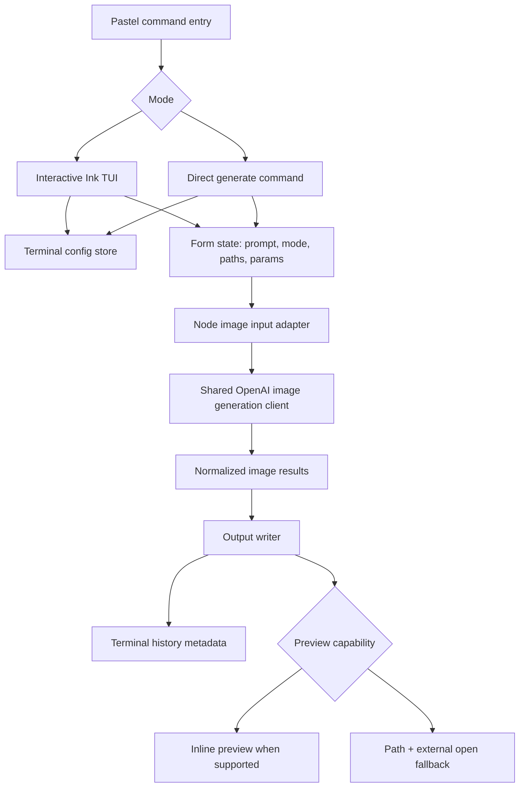

# feat: Add TokenCanvas TUI workbench

## Summary

新增一个独立的 TokenCanvas 终端工作台，使用 Pastel + Ink 构建交互式 TUI，并保留脚本友好的直接生成命令。实现上先把现有 OpenAI 图片生成能力抽成浏览器/Node 都可用的边界，再新增终端配置、文件输入、结果输出、最近历史和渐进增强图片预览。

---

## Problem Frame

TokenCanvas 浏览器版已经覆盖本地 OpenAI 图片创作，但终端用户仍需要在项目目录、素材目录或脚本中完成 prompt、参考图路径和输出文件管理。上游需求明确要求 TUI 配置和历史与浏览器版分离，计划必须避免把终端功能扩张成浏览器存储同步项目。

---

## Requirements

- R1. TUI 是 TokenCanvas 的终端工作台，不是浏览器版远程控制面板。
- R2. TUI 首版使用独立终端本地配置和历史，不读取或写入浏览器 localStorage、IndexedDB 或浏览器预设。
- R3. TUI 覆盖文生图、图生图、多参考图和 mask 编辑。
- R4. TUI 提供首次配置和后续编辑配置流程，至少覆盖 API key、模型和默认生成参数。
- R5. TUI 和直接生成命令复用同一套生成语义：prompt、模型、尺寸、数量、质量、输出格式、背景、压缩、参考图和 mask。
- R6. 结果图片保存为本地文件，并在完成后显示可复制输出路径。
- R7. 终端中清楚表达生成中、成功、失败、取消和超时状态；失败时给出可执行恢复建议。
- R8. 终端图片预览是可选增强：支持时可显示内联预览，不支持时不能影响生成、保存和后续操作。
- R9. 除交互式 TUI 入口外，首版保留脚本友好的直接生成入口。
- R10. TUI 最近结果历史与浏览器历史分离；首版只支持终端侧最近结果复查，不完整复刻浏览器历史/预设体验。

**Origin actors:** A1 终端创作者, A2 自动化使用者, A3 后续实现者
**Origin flows:** F1 首次终端配置, F2 交互式生成, F3 脚本友好的直接生成, F4 结果复查和预览
**Origin acceptance examples:** AE1 终端配置分离, AE2 多参考图输出, AE3 不支持内联预览时的 fallback, AE4 非交互生成, AE5 浏览器历史不自动出现终端结果

---

## Scope Boundaries

- 不共享浏览器版 localStorage、IndexedDB、历史或预设。
- 不把 TUI 做成浏览器版 UI 的完整复制；首版聚焦终端生成工作流。
- 不要求所有终端都能内联显示图片。
- 不实现完整图片编辑器、画布级 mask 绘制、图层系统或节点工作流。
- 不实现多人部署、后端密钥托管、云同步或远程任务队列。
- 不把批量任务系统作为首版主路径；直接生成命令只需支撑脚本化单次生成。

### Deferred to Follow-Up Work

- 批量任务系统：后续可从 JSON/CSV/目录批量生成，但首版只做单次直接生成命令。
- 浏览器/TUI 存储同步：后续如果真实使用需要，再单独设计配置、历史和预设迁移/同步。
- 更完整终端媒体能力：首版只做渐进增强预览，不做跨 tmux/SSH 的完整图像渲染矩阵。

---

## Context & Research

### Relevant Code and Patterns

- `src/lib/openai/ai-sdk-image-client.ts` 是当前生成边界，已经统一 `OpenAIImageSettings`、`OpenAIImageGenerationInput`、provider options、错误归一化和结果归一化。
- `src/lib/openai/model-discovery.ts` 已使用 `globalThis.setTimeout`、可注入 fetcher 和 `AbortSignal`，比 generation client 更接近跨运行时模式。
- `src/lib/openai/openai-endpoint.ts` 集中处理 baseURL normalize、HTTPS 校验和浏览器 dev proxy 选择，Node CLI 应复用校验，但不能走浏览器 dev proxy。
- `src/lib/openai/openai-option-sets.ts` 是尺寸、质量、格式、背景枚举单一来源，TUI 和 direct command 不能复制参数列表。
- `src/features/history/history-types.ts`、`src/features/history/history-retention.ts` 和 `src/features/presets/preset-store.ts` 提供现有 history/preset 数据语义；TUI 可以借鉴字段，但必须使用独立存储。
- `package.json` 当前只有 Vite/React 脚本和浏览器入口，没有 `bin`、CLI build 或终端 UI 依赖。
- `tsconfig.node.json` 目前只覆盖 `vite.config.ts` 和 dev proxy；新增 CLI 后需要让 Node 侧 TypeScript 检查覆盖 CLI 与跨运行时模块。

### Institutional Learnings

- `docs/solutions/integration-issues/openai-ai-sdk-image-workbench-integration-fixes-2026-05-09.md` 指出 OpenAI 请求入口要复用 endpoint 校验，带 Authorization 的请求必须先校验 endpoint，再创建敏感 header；长耗时请求要有 timeout、AbortSignal 和 stale response guard。
- 同一 learning 指出 settings、workbench、preset/store 不应复制 OpenAI 参数枚举，只从 `src/lib/openai/openai-option-sets.ts` 读取。
- `docs/solutions/ui-bugs/results-gallery-style-issues-2026-05-01.md` 记录 JS/TS 项目命令统一使用 `pnpm`，验证链路优先使用项目脚本。

### External References

- Ink official repository: `https://github.com/vadimdemedes/ink`
- Pastel official repository: `https://github.com/vadimdemedes/pastel`
- @inkjs/ui official repository: `https://github.com/vadimdemedes/ink-ui`
- AI SDK `generateImage()` reference: `https://ai-sdk.dev/docs/reference/ai-sdk-core/generate-image`
- iTerm2 Inline Images documentation: `https://iterm2.com/documentation-images.html`
- Kitty graphics protocol documentation: `https://sw.kovidgoyal.net/kitty/graphics-protocol/`

---

## Key Technical Decisions

- Use Pastel + Ink + @inkjs/ui for the CLI/TUI layer: Pastel gives command routing and argument validation, Ink preserves the existing React mental model, and @inkjs/ui provides common terminal inputs/selectors/status components.
- Require Node 22+ for the new CLI path: current `ink` resolves to `7.0.2` with `node >=22`; the local machine is already on Node 24, and downgrading to older Ink only to support older Node would add avoidable dependency churn.
- Keep terminal config under a dedicated CLI config directory: prefer an explicit `TOKENCANVAS_CONFIG_DIR`, then XDG-style user config, with credentials written using user-only file permissions where the platform supports it.
- Split browser-specific and runtime-agnostic generation concerns: existing OpenAI request semantics should remain shared, while browser `File`, `window.setTimeout`, localStorage and IndexedDB stay out of Node CLI code.
- Save output files as the durable source of truth for terminal runs: terminal history stores metadata and file paths, not duplicated image blobs.
- Support direct command JSON output from the first version: this keeps the CLI useful for automation without building a full batch system.
- Treat terminal image preview as a renderer capability, not a success condition: inline preview can use detected iTerm2/Kitty/SIXEL support later, while output paths and external opening remain the reliable baseline.

---

## Open Questions

### Resolved During Planning

- CLI/TUI library stack: use Pastel + Ink + @inkjs/ui instead of OpenTUI/Blessed because the project already uses React/TypeScript and the requested direction named Ink.
- Configuration sharing: keep terminal configuration and history separate from browser localStorage/IndexedDB, matching the confirmed requirements.
- Preview reliability: do not require terminal image preview for success; implement it as progressive enhancement.
- Direct command output: include machine-readable JSON mode because it is low-cost and materially improves scripting.

### Deferred to Implementation

- Exact config directory fallback on non-macOS platforms: implement with a small resolver and tests rather than hard-coding a platform assumption in the plan.
- Exact terminal image protocol support matrix: start with capability detection and fallback; add protocol-specific renderers only when the implementation confirms terminal behavior.
- Final command names and help text details: keep stable top-level intent, but let Pastel conventions shape exact help rendering.

---

## Output Structure

    src/cli/
      app/
        components/
        screens/
      commands/
      config/
      history/
      io/
      preview/
      main.tsx
    src/lib/openai/
      ai-sdk-image-client.ts
      image-file-adapter.ts
      node-image-output.ts

This tree shows the intended shape. Per-unit file lists below remain authoritative if implementation reveals a better split.

---

## High-Level Technical Design

> *This illustrates the intended approach and is directional guidance for review, not implementation specification. The implementing agent should treat it as context, not code to reproduce.*

The plan keeps OpenAI request semantics shared, but puts terminal-only concerns around it: config file permissions, path-based inputs, output writing, command output and optional preview rendering.

---

## Implementation Units

- U1. **Add CLI dependency and command scaffold**

**Goal:** Add the package/build surface needed to run TokenCanvas as a terminal command without disturbing the existing Vite app.

**Requirements:** R1, R9, A2, A3

**Dependencies:** None

**Files:**
- Modify: `package.json`
- Modify: `pnpm-lock.yaml`
- Modify: `tsconfig.node.json`
- Create: `src/cli/main.tsx`
- Create: `src/cli/commands/index.tsx`
- Create: `src/cli/commands/generate.tsx`
- Test: `src/cli/commands/generate.test.ts`

**Approach:**
- Add Pastel, Ink, @inkjs/ui and validation dependencies in the smallest useful set.
- Add a `bin` entry for the local package and scripts for CLI type-check/build where needed.
- Keep Vite browser build unchanged; the CLI should have its own Node-focused TypeScript coverage.
- Establish the command split early: bare command opens interactive TUI, `generate` supports non-interactive generation.

**Execution note:** Start with command parsing tests before wiring the OpenAI client, so the exported CLI contract is explicit.

**Patterns to follow:**
- Existing ESM package posture in `package.json`.
- Existing `tsconfig.node.json` as the Node-side TypeScript boundary.

**Test scenarios:**
- Happy path: invoking the default command renders or routes to the TUI entry without requiring browser globals.
- Happy path: invoking `generate` with minimal required arguments reaches the command handler rather than the interactive TUI.
- Error path: missing required prompt or output arguments returns a CLI validation failure before any OpenAI request is attempted.
- Integration: Node type-check includes CLI files while the browser app build remains scoped to the existing Vite app.

**Verification:**
- The package exposes a local executable entry and existing browser scripts remain intact.

---

- U2. **Make image generation runtime-compatible**

**Goal:** Preserve the existing OpenAI generation semantics while removing browser-only assumptions that block Node CLI use.

**Requirements:** R3, R5, R7, F2, F3, AE2, AE4

**Dependencies:** U1

**Files:**
- Modify: `src/lib/openai/ai-sdk-image-client.ts`
- Create: `src/lib/openai/image-file-adapter.ts`
- Test: `src/lib/openai/ai-sdk-image-client.test.ts`
- Test: `src/lib/openai/image-file-adapter.test.ts`

**Approach:**
- Introduce a small runtime-neutral image input shape that can be produced from browser `File` objects or Node filesystem paths.
- Replace `window` timer usage with `globalThis` timer usage, following the existing model discovery pattern.
- Keep `OpenAIImageGenerationInput` semantics intact: mode, prompt, reference images, mask, count and provider options continue to mean the same thing.
- Preserve endpoint validation and sensitive error redaction before any request with Authorization is constructed.

**Execution note:** Add characterization tests for current provider option filtering and failure normalization before changing the input adapter.

**Patterns to follow:**
- `src/lib/openai/model-discovery.ts` timeout and dependency injection style.
- `src/lib/openai/openai-endpoint.ts` endpoint validation order.
- `docs/solutions/integration-issues/openai-ai-sdk-image-workbench-integration-fixes-2026-05-09.md` sensitive request ordering guidance.

**Test scenarios:**
- Covers AE2. Happy path: multiple Node-style image inputs and a prompt are mapped into the same image generation mode as browser reference images.
- Happy path: mask mode includes source image inputs and mask input without requiring browser `File`.
- Edge case: `auto` values remain omitted from provider options, while supported explicit values are sent.
- Error path: invalid image MIME/type or oversized input returns the existing user-facing failure shape.
- Error path: timeout/abort returns a normalized cancellation failure and does not produce images.
- Integration: browser-oriented tests still pass using browser `File` inputs after the runtime-neutral adapter is introduced.

**Verification:**
- The shared client can be called from Node tests without `window`, localStorage or IndexedDB.

---

- U3. **Add terminal config and filesystem IO**

**Goal:** Provide independent terminal configuration, path-based image inputs and local output writing.

**Requirements:** R2, R4, R6, R10, F1, F2, AE1, AE5

**Dependencies:** U2

**Files:**
- Create: `src/cli/config/terminal-config-store.ts`
- Create: `src/cli/io/image-path-input.ts`
- Create: `src/lib/openai/node-image-output.ts`
- Test: `src/cli/config/terminal-config-store.test.ts`
- Test: `src/cli/io/image-path-input.test.ts`
- Test: `src/lib/openai/node-image-output.test.ts`

**Approach:**
- Store terminal settings separately from browser storage, with an overrideable config directory and user-only permissions for sensitive config files.
- Read image paths from the local filesystem and convert them into the runtime-neutral image input shape from U2.
- Write generated base64/url-normalized images to deterministic local output files; for URL outputs, download only when the client returns a URL result and clearly surface download failures.
- Keep terminal history metadata path-based so it never mutates browser IndexedDB.

**Patterns to follow:**
- `src/lib/openai/openai-settings-store.ts` normalization and default settings behavior, but without localStorage.
- `src/features/presets/preset-store.ts` enum normalization from `openai-option-sets`.
- `src/features/history/history-retention.ts` bounded retention posture.

**Test scenarios:**
- Covers AE1. Happy path: absent terminal config returns defaults and does not inspect browser storage.
- Happy path: saved API key/model/default parameters reload from terminal config.
- Error path: invalid config JSON falls back safely and reports a recoverable config error.
- Error path: unreadable reference path produces a clear failure before OpenAI generation starts.
- Happy path: generated base64 image is written to the chosen output directory with an extension derived from MIME/output format.
- Edge case: output name collision produces deterministic non-destructive filenames rather than overwriting by surprise.

**Verification:**
- Terminal config, input reading and output writing work in Node tests using temporary directories.

---

- U4. **Implement direct generate command**

**Goal:** Support script-friendly single-run image generation using the same terminal config and shared generation client as the TUI.

**Requirements:** R5, R6, R7, R9, A2, F3, AE4

**Dependencies:** U2, U3

**Files:**
- Modify: `src/cli/commands/generate.tsx`
- Create: `src/cli/commands/generate-result.ts`
- Test: `src/cli/commands/generate.test.ts`
- Test: `src/cli/commands/generate-result.test.ts`

**Approach:**
- Accept prompt, mode, output directory, reference image paths, optional mask path and OpenAI parameter overrides.
- Merge command arguments over terminal config defaults without mutating saved config.
- Print a human-readable result by default and provide a JSON mode for automation.
- Keep all error output redacted; never print the API key or Authorization header.

**Patterns to follow:**
- Existing client success/failure union from `src/lib/openai/ai-sdk-image-client.ts`.
- Existing error recommendation style from `src/lib/openai/model-discovery.ts`.

**Test scenarios:**
- Covers AE4. Happy path: complete command arguments run generation, write output files and return a success summary without opening the TUI.
- Happy path: JSON mode returns parseable output containing status, mode, model and output file paths.
- Edge case: CLI overrides default size/quality/format for one run without changing saved config.
- Error path: missing API key returns a config failure before any generation request.
- Error path: OpenAI client failure is rendered with message and recommendation, with sensitive detail redacted.
- Integration: direct command uses the same normalized generation input path as the interactive TUI.

**Verification:**
- Automation users can generate one image from a script and consume a stable JSON success/failure summary.

---

- U5. **Build interactive Ink TUI shell**

**Goal:** Create the terminal workbench UI for configuration, prompt entry, mode selection, generation parameters and run lifecycle.

**Requirements:** R1, R3, R4, R5, R7, A1, F1, F2, AE1, AE2

**Dependencies:** U1, U2, U3

**Files:**
- Create: `src/cli/app/tui-app.tsx`
- Create: `src/cli/app/screens/config-screen.tsx`
- Create: `src/cli/app/screens/generation-screen.tsx`
- Create: `src/cli/app/components/parameter-fields.tsx`
- Create: `src/cli/app/components/status-panel.tsx`
- Modify: `src/cli/commands/index.tsx`
- Test: `src/cli/app/tui-app.test.tsx`
- Test: `src/cli/app/screens/config-screen.test.tsx`
- Test: `src/cli/app/screens/generation-screen.test.tsx`

**Approach:**
- Use @inkjs/ui inputs/selects for API key, model, generation mode and OpenAI options.
- Keep configuration setup as the first-run path when terminal config is missing or invalid.
- Use existing `openai-option-sets` values so TUI choices match browser workbench semantics.
- Support manual model entry first; optionally reuse model discovery where it fits without blocking manual input.
- Show generation lifecycle in one terminal surface: idle, validating, generating, saving, success, failure and cancelled.

**Patterns to follow:**
- Browser App state flow in `src/app/App.tsx`: settings -> form -> generation client -> results/history.
- `src/features/workbench/generation-form.tsx` mode and parameter semantics.
- `src/features/settings/openai-settings-panel.tsx` setting validation posture.

**Test scenarios:**
- Covers AE1. Happy path: first launch with no terminal config shows configuration flow and saves terminal config only.
- Covers AE2. Happy path: user fills prompt and multiple reference paths, starts generation, and sees output path on success.
- Edge case: mask mode without mask path disables generation or shows a validation error before request.
- Edge case: switching modes preserves prompt and relevant parameter state while clearing invalid mode-specific inputs.
- Error path: invalid API key/model state surfaces a recoverable error and keeps the user in the TUI.
- Error path: user cancellation aborts in-flight generation and returns to editable state.

**Verification:**
- A keyboard-only terminal user can configure, generate and recover from validation errors without leaving the TUI.

---

- U6. **Add terminal history and preview fallback**

**Goal:** Give terminal users recent result recall and best-effort preview without making preview a hard dependency.

**Requirements:** R6, R8, R10, F4, AE3, AE5

**Dependencies:** U3, U4, U5

**Files:**
- Create: `src/cli/history/terminal-history-store.ts`
- Create: `src/cli/preview/preview-capability.ts`
- Create: `src/cli/preview/preview-renderer.ts`
- Create: `src/cli/app/screens/history-screen.tsx`
- Test: `src/cli/history/terminal-history-store.test.ts`
- Test: `src/cli/preview/preview-capability.test.ts`
- Test: `src/cli/preview/preview-renderer.test.ts`
- Test: `src/cli/app/screens/history-screen.test.tsx`

**Approach:**
- Store recent terminal runs as bounded metadata with output file paths, prompt, model, mode, parameters and timestamps.
- Keep a small retention cap for terminal history and never duplicate browser image blobs.
- Detect preview capability based on terminal environment and renderer support; if unsupported, render a clear output-path and external-open fallback.
- Make preview failure non-fatal: failed inline preview should not mark generation or history as failed.

**Patterns to follow:**
- `src/features/history/history-retention.ts` bounded recent-history posture.
- Origin requirement AE3 for preview fallback semantics.

**Test scenarios:**
- Covers AE3. Given preview capability is unsupported, successful generation displays output path and external-open fallback without erroring.
- Covers AE5. Terminal history write does not call browser history or IndexedDB APIs.
- Happy path: terminal history lists most recent runs first and trims beyond retention cap.
- Edge case: missing output file in history shows a stale-file state rather than crashing the TUI.
- Error path: inline preview renderer throws; UI keeps success state and shows fallback.

**Verification:**
- Recent terminal results are recoverable from the TUI, and unsupported image preview never blocks generation success.

---

- U7. **Update documentation and verification coverage**

**Goal:** Document the new terminal workflow and make the verification boundary explicit for future implementers.

**Requirements:** R1, R2, R8, R9, A3

**Dependencies:** U1, U4, U5, U6

**Files:**
- Modify: `README.md`
- Modify: `docs/brainstorms/2026-05-10-tokencanvas-tui-workbench-requirements.md` only if implementation reveals wording drift that must be corrected
- Create: `docs/solutions/integration-issues/tokencanvas-tui-workbench-integration-notes-2026-05-10.md` if execution discovers reusable integration lessons
- Test: `src/cli/**/*.test.ts`
- Test: `src/cli/**/*.test.tsx`

**Approach:**
- Add README usage for interactive TUI, direct generate command, config separation and preview limitations.
- Document that browser and terminal history are intentionally separate.
- Keep docs honest about terminal image preview support: path output is the reliable baseline, inline preview is best-effort.
- Ensure CLI tests are included in normal project test/type-check flows.

**Patterns to follow:**
- Current README positioning: local personal OpenAI image workbench.
- Existing `docs/solutions/` format only when there is a reusable learning from implementation.

**Test scenarios:**
- Test expectation: none for prose-only README changes, but CLI test files must cover behavior introduced in U1-U6.

**Verification:**
- A new user can read the README and understand how to launch TUI, run direct generation, where terminal config/history live, and why browser history is separate.

---

## System-Wide Impact

- **Interaction graph:** New CLI entry points feed terminal config, path adapters, shared OpenAI generation client, output writer, terminal history and optional preview. Browser App flow remains settings/form/client/gallery/history.
- **Error propagation:** Node config/path/output errors should normalize into CLI-friendly failures before reaching Ink screens; OpenAI errors continue through the existing client failure shape.
- **State lifecycle risks:** Terminal config writes must avoid corrupting credentials; generation cancellation must not leave partial history entries as successful runs; output writers must avoid surprise overwrite.
- **API surface parity:** Browser form and TUI/direct command must share OpenAI parameter semantics, enum values and generation modes.
- **Integration coverage:** Tests must prove direct command, TUI state and shared generation adapter all use the same normalized generation input path.
- **Unchanged invariants:** Browser localStorage, IndexedDB history, Vite dev proxy and React workbench UI remain functionally separate from terminal config/history.

---

## Risks & Dependencies

| Risk | Mitigation |
|------|------------|
| Ink 7 requires Node 22+, while some users may run older Node | State Node 22+ requirement in package/docs and avoid downgrading the stack in this plan |
| API key could leak in config files, logs or error output | Use user-only config permissions where supported and keep existing redaction behavior for all displayed failures |
| Browser and terminal generation semantics drift | Reuse `openai-option-sets`, shared client types and shared provider option tests |
| Terminal image preview behaves inconsistently across terminal emulators, tmux or SSH | Treat preview as best-effort and keep output path/external open as the reliable baseline |
| Adding CLI build setup breaks browser build | Keep Node TypeScript config separate and include verification for existing Vite build/test scripts |
| History metadata points to files the user later deletes | Render stale-file state in terminal history rather than failing the entire history screen |

---

## Documentation / Operational Notes

- README should explain TUI and browser storage separation explicitly.
- README should show both interactive and direct command examples.
- CLI docs should warn that API key is stored locally for personal use and should not be committed.
- No production deployment, data migration or cloud rollout is part of this plan.

---

## Sources & References

- **Origin document:** [docs/brainstorms/2026-05-10-tokencanvas-tui-workbench-requirements.md](docs/brainstorms/2026-05-10-tokencanvas-tui-workbench-requirements.md)
- Related code: `src/lib/openai/ai-sdk-image-client.ts`
- Related code: `src/lib/openai/model-discovery.ts`
- Related code: `src/lib/openai/openai-endpoint.ts`
- Related code: `src/lib/openai/openai-option-sets.ts`
- Related code: `src/features/history/history-types.ts`
- Related code: `src/features/history/history-retention.ts`
- Related code: `src/features/presets/preset-store.ts`
- Institutional learning: `docs/solutions/integration-issues/openai-ai-sdk-image-workbench-integration-fixes-2026-05-09.md`
- External docs: [Ink](https://github.com/vadimdemedes/ink)
- External docs: [Pastel](https://github.com/vadimdemedes/pastel)
- External docs: [@inkjs/ui](https://github.com/vadimdemedes/ink-ui)
- External docs: [AI SDK generateImage](https://ai-sdk.dev/docs/reference/ai-sdk-core/generate-image)
- External docs: [iTerm2 Inline Images](https://iterm2.com/documentation-images.html)
- External docs: [Kitty graphics protocol](https://sw.kovidgoyal.net/kitty/graphics-protocol/)
