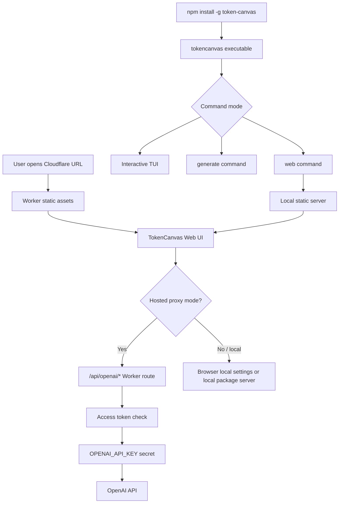

# feat: Release TokenCanvas on Cloudflare and npm

## Summary

让 TokenCanvas 具备两个正式分发路径：Cloudflare 上可访问的 Web UI，以及 npm 上可安装的 `tokencanvas` 命令。实现上把现有 Vite SPA、Worker 代理、CLI/TUI、直接生成命令和本地 Web UI 启动模式整理成清晰的运行时边界，避免把开发态 `tsx` 入口或本地 Vite proxy 当成生产发布能力。

---

## Problem Frame

当前仓库已经同时支持浏览器 Web UI、Ink TUI 和脚本友好的 CLI 生成命令，但这些能力仍主要面向本地源码运行。`package.json` 仍是 `private: true`，`bin` 指向 `src/cli/main.tsx`，Cloudflare 部署也缺少生产 Worker、secrets、SPA fallback 和 API 代理边界。

---

## Assumptions

*This plan was authored without synchronous user confirmation. The items below are agent inferences that fill gaps in the input and should be reviewed before implementation proceeds.*

- Cloudflare 部署按个人/小范围使用设计，而不是公开多人 SaaS。
- Cloudflare Web UI 需要服务端 OpenAI 代理与访问保护，不能把带服务端密钥的 `/api/openai/*` 做成公开匿名代理。
- npm 包的 Web UI 模式表示本地安装后运行 `tokencanvas web` 启动内置 Web UI，而不是让 npm 包替代 Cloudflare 托管服务。
- npm 首发发布公开包，计划使用 `token-canvas` 作为包名，保留 `tokencanvas` 作为命令名；2026-05-10 通过 `npm view token-canvas` 验证 registry 当前返回 404 未占用，但真实发布前仍需重查。

---

## Requirements

- R1. Cloudflare 上必须能部署 Web UI，并正确处理 SPA 刷新、静态资源缓存和 `/api/openai/*` API 路由。
- R2. Cloudflare 生产部署必须使用 Worker secret 保存 OpenAI API key，并给代理入口加访问保护，避免公开滥用服务端 key。
- R3. Cloudflare 托管模式必须与本地浏览器模式区分清楚：托管模式使用 Worker 代理，本地模式继续支持当前浏览器本地配置和开发代理。
- R4. npm 包必须提供可安装的 `tokencanvas` 可执行入口，支持现有交互式 TUI 和直接生成命令。
- R5. npm 包必须提供 Web UI 模式，用户安装后可在本机启动 Web 工作台，而不需要克隆仓库或运行 Vite dev server。
- R6. npm 包不得发布测试、源码草稿、开发脚本垃圾或本地配置；发布内容必须由可审计的 build/pack 产物决定。
- R7. 发布流程必须有可重复验证的 CI 门禁，覆盖单测、Node typecheck、Web build、Cloudflare worker build、package dry-run 和 CLI smoke。
- R8. README 和部署文档必须明确 Cloudflare secrets、访问保护、npm 安装方式、CLI/TUI/Web UI 三种模式以及现有数据边界。

---

## Scope Boundaries

- 不把 TokenCanvas 做成多租户账号系统、团队 key 托管平台或云同步产品。
- 不引入数据库、队列、图片长期云存储或远程任务历史。
- 不把 Cloudflare Worker 代理扩展成任意 OpenAI-compatible provider 网关；首版只服务当前 OpenAI 请求路径。
- 不发布未编译的 `src/cli/main.tsx` + `tsx` 开发入口作为 npm 用户入口。
- 不在计划阶段直接执行 Cloudflare 或 npm 生产发布。

### Deferred to Follow-Up Work

- Cloudflare Access / Zero Trust 的组织级策略配置：仓库内先提供 Worker 级共享 token 或明确接入点，团队级访问策略可在部署环境侧单独强化。
- 异步图片任务队列：如果 Cloudflare 请求时限或 OpenAI 长耗时生成成为真实瓶颈，再单独设计队列、轮询和状态存储。
- npm library API：首发只承诺可执行工具和本地 Web UI，不承诺稳定 JavaScript SDK 导出。

---

## Context & Research

### Relevant Code and Patterns

- `package.json` 当前 `private: true`，并且 `bin.tokencanvas` 指向 `src/cli/main.tsx`，这适合本仓库开发，不适合作为 npm install 后的稳定入口。
- `README.md` 已记录终端模式、`pnpm cli`、`pnpm cli -- generate`、`TOKENCANVAS_CONFIG_DIR` 和“公开部署前应补后端代理和服务端密钥管理”的边界。
- `vite.config.ts` 目前只在 Vite dev server 注册 `openai-dev-proxy` middleware；生产 `vite build` 的 `dist` 不包含该代理能力。
- `src/lib/openai/openai-endpoint.ts` 只在 `localhost` / `127.0.0.1` 下启用 dev proxy；Cloudflare 域名不会自动走本地 dev proxy。
- `src/lib/openai/openai-dev-proxy.ts` 已有 OpenAI proxy 的 URL、安全和 header 边界，可作为 Worker 代理设计的行为参考，但 Node middleware 不能直接当作 Worker runtime 代码使用。
- `src/cli/main.tsx` 使用 `#!/usr/bin/env -S node --import tsx`，这是开发态 shebang；npm 发布产物需要普通 Node 可执行 JS。
- `src/cli/commands/generate.tsx`、`src/cli/runtime/commands/generate.tsx`、`src/cli/commands/generate-result.ts` 已经形成 TUI 与直接生成命令复用的模式，新 Web UI 命令应沿用同一 Pastel command 结构。
- `src/cli/openai/rest-image-client.ts` 已包含 CLI 侧 REST fallback、超时、错误脱敏和 Cloudflare 524 恢复建议；Cloudflare Worker 代理的失败语义应与这条链路保持一致。
- `docs/solutions/integration-issues/tokencanvas-tui-workbench-integration-notes-2026-05-10.md` 记录了跨运行时边界、代理、配置原子写入、`--json` stdout 干净和 e2e 独占端口是本项目已踩过的关键风险。

### Institutional Learnings

- 跨运行时模块不能偷偷依赖 `window`、`File`、localStorage、IndexedDB 或 Node 文件系统；要通过明确 adapter、transport 或 build target 过边界。
- 发布/交付门禁保持为 `pnpm test`、`pnpm run typecheck:node`、`pnpm run build`、`pnpm run test:e2e`，跨运行时改动开 PR 前还应跑 code review。
- e2e 不能复用未知本地 Vite 进程；Cloudflare 和 npm package smoke 也应使用独立端口与明确启动/关闭生命周期。

### External References

- Cloudflare Workers static assets support Worker code and static files in one deployment unit, and can route unmatched SPA paths back to `index.html`: https://developers.cloudflare.com/workers/static-assets/
- Cloudflare Vite plugin can build front-end assets for Workers and auto-populate static asset output during `vite build`: https://developers.cloudflare.com/workers/vite-plugin/
- Cloudflare Vite static asset docs show `not_found_handling = "single-page-application"` for SPA fallback: https://developers.cloudflare.com/workers/vite-plugin/reference/static-assets/
- Cloudflare Workers secrets are encrypted bindings for API keys and auth tokens, accessed from Worker `env`: https://developers.cloudflare.com/workers/configuration/secrets/
- npm `package.json` docs require publishable packages to have stable `name` / `version`, and `bin` maps command names to executable files that should start with a Node shebang: https://docs.npmjs.com/cli/v7/configuring-npm/package-json/
- npm publish docs recommend `npm pack --dry-run` to inspect included files before publishing and note name/version reuse constraints: https://docs.npmjs.com/cli/v10/commands/npm-publish/
- npm trusted publishing supports OIDC-based GitHub Actions publishing and automatic provenance for public packages from public repos: https://docs.npmjs.com/trusted-publishers/

---

## Key Technical Decisions

- Use Cloudflare Workers static assets rather than Pages-only deployment: the Web UI needs a production `/api/openai/*` proxy and secrets, so a Worker + assets unit is a better match than a purely static Pages build.
- Keep Cloudflare proxy server-managed and protected: the Worker reads `OPENAI_API_KEY` from secrets and requires a deployment access token or external access layer before proxying requests.
- Keep local Web UI mode inside the npm package separate from Cloudflare hosted mode: `tokencanvas web` serves packaged static assets locally and can reuse the existing Node proxy behavior, while Cloudflare uses Worker runtime code.
- Build publishable artifacts into `dist/`: CLI executable JS, local web server JS, Worker build output, and Web UI static assets should be generated, not interpreted from TypeScript source at install time.
- Use a narrow npm package surface: `files` should include only `dist`, `README.md`, `LICENSE` and any required package metadata; tests, plans, solutions and source should stay out unless explicitly needed for runtime.
- Prefer GitHub Actions trusted publishing for npm: the remote is GitHub, and OIDC avoids long-lived npm automation tokens when package ownership is ready.

---

## Open Questions

### Resolved During Planning

- Cloudflare target: use Workers static assets + Worker proxy instead of Pages-only static hosting, because production proxy/secrets are in scope.
- npm Web UI meaning: expose a local `tokencanvas web` mode from the installed package, while Cloudflare handles hosted Web UI.
- npm package naming: prefer `token-canvas` over `openai-token-canvas`; the former matches the product brand, while the latter may imply an OpenAI-owned or OpenAI-only adapter package.
- Secret handling: never place OpenAI API key in `wrangler.jsonc`, `.env` committed files, package files or client bundle.

### Deferred to Implementation

- Final npm package availability: re-run `npm view token-canvas` immediately before first publish because npm name availability can change at any time.
- Exact bundler choice for CLI artifacts: implementer may use `tsup`, `esbuild`, or a repo-consistent build script if it produces audited ESM executable output and keeps peer/runtime dependencies correct.
- Cloudflare access strategy details: choose Worker shared token, Cloudflare Access, or both based on the deploy target; the plan requires some protection but does not prescribe the operator's account-level policy.

---

## Output Structure

    src/worker/
      index.ts
      openai-proxy.ts
      openai-proxy.test.ts
    src/cli/web/
      static-server.ts
      static-server.test.ts
    src/cli/runtime/commands/
      web.tsx
    scripts/
      build-package.mjs
      smoke-package.mjs
    .github/workflows/
      cloudflare-deploy.yml
      npm-publish.yml
    docs/deployment/
      cloudflare.md
      npm.md
    wrangler.jsonc

This tree shows the intended output shape. Per-unit file lists below remain authoritative if implementation reveals a cleaner split.

---

## High-Level Technical Design

> *This illustrates the intended approach and is directional guidance for review, not implementation specification. The implementing agent should treat it as context, not code to reproduce.*

Cloudflare and npm share the same Web UI build where practical, but they do not share runtime secrets or proxy code. Worker code owns hosted secrets; Node CLI code owns local filesystem, TUI, direct command and local web server behavior.

---

## Implementation Units

- U1. **Add Cloudflare Worker deployment surface**

**Goal:** Create the Worker + static assets deployment target for the existing Vite SPA.

**Requirements:** R1, R3, R7

**Dependencies:** None

**Files:**
- Create: `wrangler.jsonc`
- Create: `src/worker/index.ts`
- Modify: `vite.config.ts`
- Modify: `package.json`
- Modify: `pnpm-lock.yaml`
- Test: `src/worker/index.test.ts`

**Approach:**
- Add Cloudflare Worker/Vite dependencies and a deploy build path that keeps the existing local Vite dev workflow intact.
- Configure SPA fallback with Cloudflare static assets routing so refreshed app routes return `index.html`.
- Route `/api/openai/*` through Worker code before static asset fallback.
- Keep compatibility date explicit in Cloudflare config and avoid committing secrets or account-specific IDs that should remain operator configuration.

**Patterns to follow:**
- Existing `vite.config.ts` plugin style for wiring runtime-specific behavior.
- Current `scripts/run-playwright-e2e.mjs` preference for explicit server lifecycle rather than relying on ambient processes.

**Test scenarios:**
- Happy path: request for `/` returns the Web UI asset response from the Worker/static assets path.
- Happy path: request for an unknown SPA route returns the same app shell rather than a 404.
- Integration: request under `/api/openai/` is handled by Worker API logic and not by static asset fallback.
- Error path: missing static asset returns the configured SPA fallback only for navigation-like paths, not for API paths.

**Verification:**
- Cloudflare build output contains both Worker entry and Web UI assets, and existing local `pnpm run dev` behavior remains usable.

---

- U2. **Implement protected Cloudflare OpenAI proxy**

**Goal:** Provide a production-safe Worker proxy for hosted Web UI image generation and model discovery.

**Requirements:** R2, R3, R7

**Dependencies:** U1

**Files:**
- Create: `src/worker/openai-proxy.ts`
- Modify: `src/worker/index.ts`
- Modify: `src/lib/openai/openai-endpoint.ts`
- Test: `src/worker/openai-proxy.test.ts`
- Test: `src/lib/openai/openai-endpoint.test.ts`

**Approach:**
- Recreate the existing dev proxy's allowlist mindset in Worker runtime: narrow upstream paths, narrow methods, controlled headers, no cookie forwarding and sensitive error redaction.
- Read `OPENAI_API_KEY` and proxy access secret from Worker `env`; fail closed when required secrets are absent.
- Use an explicit hosted-proxy target resolver so Cloudflare production does not rely on the localhost-only dev proxy condition.
- Preserve current local behavior for browser development and CLI/TUI.

**Execution note:** Start with proxy contract tests for auth failure, missing secret, allowed model discovery and allowed image generation before wiring UI.

**Patterns to follow:**
- `src/lib/openai/openai-dev-proxy.ts` for endpoint validation, private target caution and header allowlisting.
- `src/lib/openai/response-normalizer.ts` and `src/cli/openai/rest-image-client.ts` for normalized OpenAI failure detail and redaction.

**Test scenarios:**
- Happy path: authenticated `/api/openai/models` request is forwarded with server-side Authorization and returns upstream JSON.
- Happy path: authenticated image generation request forwards only allowed content headers and uses the Worker secret, not a browser-provided OpenAI key.
- Error path: missing proxy access token returns an auth failure without contacting OpenAI.
- Error path: missing `OPENAI_API_KEY` secret returns an operator-facing configuration failure without exposing env details.
- Error path: disallowed method/path is rejected before upstream fetch.
- Error path: upstream 401/5xx response is passed back with sensitive details redacted.

**Verification:**
- The deployed API route cannot be used as an anonymous OpenAI proxy and does not expose the Worker secret to the client bundle or response payloads.

---

- U3. **Add hosted Web UI runtime mode**

**Goal:** Let the browser app use Cloudflare hosted proxy mode without breaking current local browser settings.

**Requirements:** R2, R3, R8

**Dependencies:** U2

**Files:**
- Modify: `src/lib/openai/openai-settings-store.ts`
- Modify: `src/features/settings/openai-settings-panel.tsx`
- Modify: `src/app/App.tsx`
- Modify: `src/lib/openai/model-discovery.ts`
- Modify: `src/lib/openai/ai-sdk-image-client.ts`
- Test: `src/lib/openai/openai-settings-store.test.ts`
- Test: `src/lib/openai/model-discovery.test.ts`
- Test: `src/lib/openai/ai-sdk-image-client.test.ts`
- Test: `src/features/settings/openai-settings-panel.test.tsx`
- Test: `src/app/App.test.tsx`

**Approach:**
- Add a small runtime configuration boundary that can tell the app whether it is running in hosted proxy mode.
- In hosted mode, avoid requiring the browser user to enter an OpenAI API key; require only the deployment access token if the chosen Worker protection uses app-level token.
- Ensure generation and model discovery both target `/api/openai/*` consistently in hosted mode.
- Keep local browser storage schema migration explicit so existing local users do not lose settings.

**Patterns to follow:**
- Existing local config store migration style in `src/lib/storage/local-config-store.ts` and settings tests.
- Existing settings panel validation and error display patterns.
- Existing `resolveOpenAIModelsRequestTarget` / `resolveOpenAIProviderTransport` separation in `src/lib/openai/openai-endpoint.ts`.

**Test scenarios:**
- Happy path: hosted mode renders settings without requiring a browser OpenAI API key and sends requests to `/api/openai/*`.
- Happy path: local mode still reads/writes browser API key, baseURL, model and proxy settings as before.
- Edge case: existing stored local settings without hosted fields migrate without data loss.
- Error path: hosted mode with missing deployment access token blocks generation with a clear recovery action.
- Integration: model discovery and image generation use the same hosted proxy mode and access token behavior.

**Verification:**
- A hosted Cloudflare build can generate through Worker proxy, while a local Vite/browser session keeps its current local-only behavior.

---

- U4. **Create publishable npm package artifacts**

**Goal:** Convert the project from source-only development execution into an auditable npm package with compiled runtime entry points.

**Requirements:** R4, R6, R7

**Dependencies:** None

**Files:**
- Modify: `package.json`
- Modify: `pnpm-lock.yaml`
- Create: `scripts/build-package.mjs`
- Create: `scripts/smoke-package.mjs`
- Modify: `.gitignore`
- Test: `src/cli/commands/generate.test.ts`
- Test: `src/cli/runtime/terminal-mode.test.ts`

**Approach:**
- Remove `private: true` only when the package metadata is complete: publishable name, description, license, repository, bugs, homepage, engines and package manager.
- Set `package.json.name` to `token-canvas`, while keeping `bin.tokencanvas` as the user-facing executable command.
- Replace `bin.tokencanvas` with a compiled `dist` executable that starts with a standard Node shebang.
- Generate package artifacts in a deterministic build step and verify the packlist with `npm pack --dry-run` / JSON output during CI.
- Keep runtime dependencies needed by CLI/TUI installed as package dependencies; keep build/test-only dependencies in devDependencies.
- Add `files` so npm publication includes only runtime artifacts and public docs/license.

**Execution note:** Treat package packlist as a contract test; fail the build if source tests, plans, local config or generated junk enter the tarball.

**Patterns to follow:**
- Current `src/cli/main.tsx` and Pastel command layout for executable behavior.
- README command docs for `pnpm cli` and direct generation.

**Test scenarios:**
- Happy path: package build produces an executable `dist` entry with a Node shebang.
- Happy path: generated packlist contains runtime JS, Web UI assets, README, LICENSE and package metadata.
- Error path: packlist does not include `src/**/*.test.*`, `docs/plans/**`, `docs/solutions/**`, local `.env` files or temporary output directories.
- Integration: installing the packed tarball in a temporary project makes `tokencanvas --help` and `tokencanvas generate --help` runnable without the source checkout.

**Verification:**
- A user can install the packed tarball and run the CLI/TUI entry without `tsx`, Vite dev server or repository source files.

---

- U5. **Add npm Web UI mode**

**Goal:** Let npm users launch the Web UI locally from the installed package.

**Requirements:** R5, R7, R8

**Dependencies:** U4

**Files:**
- Create: `src/cli/web/static-server.ts`
- Create: `src/cli/runtime/commands/web.tsx`
- Modify: `src/cli/runtime/commands/index.tsx`
- Modify: `scripts/build-package.mjs`
- Test: `src/cli/web/static-server.test.ts`
- Test: `src/cli/commands/generate.test.ts`

**Approach:**
- Add a `web` command that serves packaged Web UI assets from `dist/web` on a local port and prints the URL.
- Reuse the existing Node OpenAI proxy behavior for local Web UI when the user enables proxy mode, rather than requiring Vite middleware.
- Make port, host and open-browser behavior explicit command options.
- Ensure missing packaged assets fail with a packaging/build error rather than a blank server.

**Patterns to follow:**
- `src/cli/runtime/commands/generate.tsx` re-export pattern for Pastel runtime command mapping.
- Existing `openai-dev-proxy` middleware behavior for local proxy semantics.
- Existing e2e preference for strict, explicit ports.

**Test scenarios:**
- Happy path: `tokencanvas web` starts a local server and serves `index.html` for `/`.
- Happy path: refreshing a nested Web UI route returns the app shell.
- Happy path: local `/api/openai/*` requests are routed to the Node proxy only when explicitly enabled.
- Edge case: requested port is occupied, command exits with a clear alternative-port instruction.
- Error path: packaged Web UI assets are missing, command fails with a build/package recovery message.
- Integration: packed npm tarball can start Web UI mode from outside the repository.

**Verification:**
- npm-installed users can choose `tokencanvas` for TUI, `tokencanvas generate` for script mode and `tokencanvas web` for local browser mode.

---

- U6. **Add release CI for Cloudflare and npm**

**Goal:** Make deployment and package publication repeatable without relying on manual local state.

**Requirements:** R1, R6, R7

**Dependencies:** U1, U2, U4, U5

**Files:**
- Create: `.github/workflows/cloudflare-deploy.yml`
- Create: `.github/workflows/npm-publish.yml`
- Modify: `package.json`
- Create: `docs/deployment/cloudflare.md`
- Create: `docs/deployment/npm.md`

**Approach:**
- Add a Cloudflare deploy workflow that installs with pnpm, runs the verification suite, builds Worker/static assets and deploys using repository secrets.
- Add an npm publish workflow intended for trusted publishing from GitHub Actions on version tags.
- Keep publish workflow dry-run capable for PRs and actual publish only for the chosen release trigger.
- Document required secrets and npm trusted publisher setup, including the exact workflow filename that npm must trust.

**Patterns to follow:**
- Existing README delivery standard: test/typecheck/build/e2e before release actions.
- npm trusted publishing guidance for OIDC and provenance.

**Test scenarios:**
- Happy path: PR workflow runs tests, package build and npm pack dry-run without publishing.
- Happy path: tag workflow publishes only after build and pack checks pass.
- Error path: missing Cloudflare secrets fails deployment before any partial deploy step.
- Error path: package version already exists, publish job fails clearly and does not retry with mutated metadata.
- Integration: CI artifact or log includes packlist evidence sufficient to inspect what would be published.

**Verification:**
- Release actions are reproducible from CI and no long-lived npm token is required when trusted publishing is configured.

---

- U7. **Document deployment, installation and mode boundaries**

**Goal:** Make the new release paths understandable and safe for users/operators.

**Requirements:** R8

**Dependencies:** U1, U2, U3, U4, U5, U6

**Files:**
- Modify: `README.md`
- Create: `docs/deployment/cloudflare.md`
- Create: `docs/deployment/npm.md`

**Approach:**
- Update README quick start with npm install, `tokencanvas`, `tokencanvas generate` and `tokencanvas web`.
- Add Cloudflare deployment docs covering build command, Worker secrets, access protection, SPA fallback and hosted proxy mode.
- Add npm release docs covering package name/version, `npm pack --dry-run`, trusted publishing, provenance and installation smoke.
- Keep security language explicit: browser local mode stores browser-local user key, Cloudflare hosted mode uses Worker secret, CLI/TUI uses terminal config.

**Patterns to follow:**
- Current README's direct, command-oriented Chinese documentation style.
- Current data/security boundary section in README.

**Test scenarios:**
- Test expectation: none for prose-only docs, but docs must include concrete commands, required env/secrets and mode boundary table.

**Verification:**
- A maintainer can follow the docs to identify required secrets and choose the correct mode without reading source code.

---

## System-Wide Impact

- **Interaction graph:** Web UI generation/model discovery can now flow through local browser config, local package server proxy or Cloudflare Worker proxy. CLI/TUI generation remains terminal-config driven and should not depend on Worker code.
- **Error propagation:** Worker proxy errors must preserve user-actionable messages while redacting secrets. npm Web UI server errors should fail at command level, not render a blank browser app.
- **State lifecycle risks:** Browser local settings, terminal config and Cloudflare secrets are three separate stores. The implementation must avoid implicit syncing or accidental migration between them.
- **API surface parity:** `tokencanvas`, `tokencanvas generate` and `tokencanvas web` become public CLI contracts. Changes to flags, stdout JSON and exit codes need tests.
- **Integration coverage:** Unit tests are not enough; package smoke and Cloudflare Worker route tests must prove built artifacts work outside the source checkout.
- **Unchanged invariants:** Browser IndexedDB/localStorage history, terminal history and npm package Web UI local state remain separate. No cloud history sync or multi-user account model is added.

---

## Risks & Dependencies

| Risk | Mitigation |
|------|------------|
| Cloudflare proxy becomes an open proxy for a server-side OpenAI key | Require Worker secret plus access protection before proxying; reject missing auth before upstream fetch |
| npm package ships source/tests or misses runtime assets | Add explicit `files`, deterministic package build and packlist smoke checks |
| `bin` works in source checkout but fails after install | Build executable JS with standard shebang and test packed tarball in a temp project |
| Cloudflare hosted mode drifts from local Web UI mode | Keep shared request target resolver tests for model discovery and generation |
| Local Web UI mode accidentally depends on Vite dev server | Serve built static assets from package and add smoke test outside repo |
| Long image generation exceeds Cloudflare request behavior | Keep first release synchronous but document risk; defer async queue until measured need |
| npm trusted publishing is misconfigured | Document exact workflow filename, repository URL requirement and dry-run before tag publish |

---

## Documentation / Operational Notes

- Cloudflare operator setup must include `OPENAI_API_KEY` and whichever proxy access secret/policy the implementation chooses.
- If the deployed Cloudflare URL is public, route-level protection is not optional because the Worker holds a reusable OpenAI key.
- npm release should start with a fresh `npm view token-canvas`, a dry-run and packed-tarball install smoke before the first real publish.
- Because npm name/version pairs cannot be reused after publish, first real publication should happen only after package metadata and smoke checks are reviewed.
- The Cloudflare deployment and npm publication can land in separate PRs if review risk is high, but the plan keeps them together because the user requested both release paths as one distribution effort.

---

## Sources & References

- Related code: `package.json`
- Related code: `vite.config.ts`
- Related code: `src/lib/openai/openai-endpoint.ts`
- Related code: `src/lib/openai/openai-dev-proxy.ts`
- Related code: `src/cli/main.tsx`
- Related code: `src/cli/commands/generate.tsx`
- Related learning: `docs/solutions/integration-issues/tokencanvas-tui-workbench-integration-notes-2026-05-10.md`
- External docs: https://developers.cloudflare.com/workers/static-assets/
- External docs: https://developers.cloudflare.com/workers/vite-plugin/
- External docs: https://developers.cloudflare.com/workers/vite-plugin/reference/static-assets/
- External docs: https://developers.cloudflare.com/workers/configuration/secrets/
- External docs: https://docs.npmjs.com/cli/v7/configuring-npm/package-json/
- External docs: https://docs.npmjs.com/cli/v10/commands/npm-publish/
- External docs: https://docs.npmjs.com/trusted-publishers/
