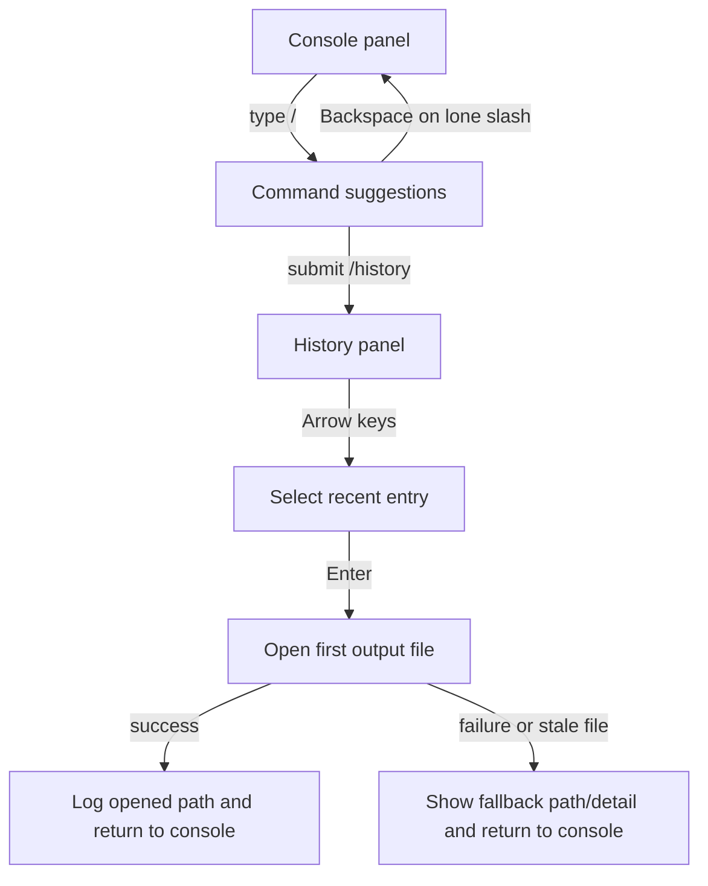

# fix: Refine CLI command input and history recall

## Summary

收紧 TokenCanvas TUI 的命令输入和历史复查交互：让底部 slash 输入在只输入 `/` 时仍可正常退格退出，把“最近结果”从常驻底部区域改成按需触发的 `/history` 面板，并在确认历史项后直接打开对应输出图片，同时保留终端路径回退。

---

## Problem Frame

当前 TUI 的核心功能已经可用，但交互形态还有两个明显摩擦点。第一，slash 输入框把命令联想和文本编辑绑在同一个轻量状态上，`src/cli/app/components/command-input.tsx` 只靠 Ink 的基础按键事件逐字符维护字符串，导致“刚输入 `/` 想退出命令态”这一最小动作缺少专门保障。第二，`src/cli/app/tui-app.tsx` 无条件在主工作区底部渲染 `src/cli/app/screens/history-screen.tsx`，让最近结果长期占据视野，即使用户当前只是想继续输入 prompt 或调参数。

这两个问题都落在已有终端工作台范围内，不需要改变生成链路、终端历史存储格式或浏览器侧行为。计划的重点是把“输入态”“浏览态”和“打开结果图”拆开，各自给清楚的键盘路径和失败回退。

---

## Requirements

- R1. TUI 必须继续保持终端工作台定位，不把历史查看重新推回浏览器或 Web UI。
- R7. 终端里的状态与恢复动作必须清楚表达，历史打开失败不能把整个工作区打断。
- R10. 终端最近结果历史仍然与浏览器历史分离，但不应再以常驻底部面板的形式持续遮挡主视野。
- R11. 当用户只输入一个 `/` 进入命令检索态时，普通退格必须能把输入框恢复为空，不能出现“像删不掉”的卡住体验。
- R12. TUI 必须提供 `/history` 指令，打开一个可键盘导航的最近结果下拉/列表视图，而不是始终把所有历史项渲染在主界面底部。
- R13. 用户在 `/history` 列表中确认一条历史记录后，TUI 必须尝试打开该记录的首个输出图片；若本机打开动作失败或文件缺失，界面要退回为可执行的路径提示，而不是静默失败。

**Origin actors:** A1 (终端创作者), A3 (后续实现者)
**Origin flows:** F2 (交互式生成), F4 (结果复查和预览)
**Origin acceptance examples:** AE3 (covers R7, R8), AE5 (covers R10)

---

## Scope Boundaries

- 不改动 `generate` 直出命令的参数语义、JSON 输出和写盘流程。
- 不把终端历史和浏览器历史、预设或 IndexedDB 重新打通。
- 不在本轮引入 history rerun、history delete、history rename 等额外历史管理能力。
- 不要求在所有终端里做真正的图片 inline thumbnail；本轮优先解决视野占用和结果打开路径。

### Deferred to Follow-Up Work

- 历史项二次操作（如 rerun、save as preset、多文件选择）单独作为后续 TUI 增强处理。
- 若后续确认需要更完整的命令面板体验，再评估 fuzzy search 高亮、分页和分组展示，而不是在本轮顺手扩展。

---

## Context & Research

### Relevant Code and Patterns

- `src/cli/app/components/command-input.tsx` 目前用 `useInput` 手写输入缓冲、候选联想和 Tab 补全；退格逻辑只做 `slice(0, -1)`，没有针对“lone slash / 命令态退出”建模。
- `src/cli/app/screens/generation-screen.tsx` 持有 `COMMANDS` 常量和 `panel` 状态，是 slash 指令分发、日志输出和键盘焦点切换的真实控制面。
- `src/cli/app/tui-app.tsx` 当前在生成工作区下方永久挂载 `HistoryScreen`，这正是底部视野被占用的直接来源。
- `src/cli/app/screens/history-screen.tsx` 目前只是静态文本渲染器：列 prompt、model、输出路径和可选 preview，没有选择态、回调或打开动作。
- `src/cli/app/components/confirmable-select.tsx` 已经提供上下键选择 + Enter 确认 + 可视窗口裁剪，适合复用为历史列表的键盘导航骨架。
- `src/cli/history/terminal-history-store.ts` 已保证历史条目 recent-first、限量裁剪和并发写锁，本轮不需要改存储契约。
- `src/cli/preview/preview-renderer.ts` 已有“文件缺失 -> 路径提示”的回退语义，可以延续到 history open 失败场景。

### Institutional Learnings

- `docs/solutions/integration-issues/tokencanvas-tui-workbench-integration-notes-2026-05-10.md` 已明确终端侧要把主结果和附属动作分开处理；历史预览/打开失败不应把一次成功生成重新标记成失败。

### External References

- 本次规划不需要外部资料。仓库内已有完整 TUI 模式、键盘交互模式和历史边界约束，可直接沿本地模式扩展。

---

## Key Technical Decisions

- `/history` 采用显式命令入口，而不是继续保留 `TuiApp` 底部常驻历史块：这样能把“创作输入”和“结果复查”拆成两个清楚的面板状态，减少主视野抖动。
- 历史浏览状态放回 `GenerationScreen` 的 `panel` 控制面统一管理，而不是让 `TuiApp` 和 `HistoryScreen` 各自维护一套输入焦点：当前 slash 指令、日志和配置面板都在这里，继续集中管理最符合现有结构。
- 历史列表优先复用 `ConfirmableSelect` 的键盘选择模式，而不是新造另一套上下键滚动组件；本轮真正新增的是 history item label/detail 组织和“确认后打开文件”的副作用。
- “打开图片”使用独立的 CLI helper 返回结构化结果，让 `HistoryScreen`/`GenerationScreen` 只处理成功日志与失败回退，不直接耦合平台命令细节。
- 命令输入修复以“输入状态机更明确”为目标，而不是只补一个特殊 if。实现时应把命令前缀、候选态和删除/cancel 语义分清，确保 lone slash、已补全命令、普通 prompt 输入三种状态都可预测。

---

## Open Questions

### Resolved During Planning

- 历史入口应该放在哪里？使用 `/history` 作为显式入口，沿用当前 slash command 工作区心智，不再让历史常驻底部。
- 选择历史项后应该做什么？默认打开该条记录的首个输出图片，并在日志区同步打印路径，便于终端不支持 GUI 或打开失败时继续手动操作。
- 是否需要改历史存储格式？不需要。现有 `TerminalHistoryEntry.outputFiles[0]` 已足够支撑“打开对应图片”的主路径。

### Deferred to Implementation

- 非 macOS 平台使用哪种 opener 组合最合适：实现时按运行平台决定，但需要保留“命令不存在/调用失败 -> 回退为路径提示”的统一结果语义。
- `/history` 列表里展示多少文本最合适：实现时根据终端宽度做截断与 detail 区分，避免长 prompt 把列表挤坏。

---

## High-Level Technical Design

> *This illustrates the intended approach and is directional guidance for review, not implementation specification. The implementing agent should treat it as context, not code to reproduce.*

---

## Implementation Units

- U1. **Stabilize slash-input editing semantics**

**Goal:** Make the command input reliably reversible so a user can enter `/`, browse suggestions, and back out with normal deletion keys.

**Requirements:** R7, R11

**Dependencies:** None

**Files:**
- Modify: `src/cli/app/components/command-input.tsx`
- Test: `src/cli/app/components/command-input.test.tsx`

**Approach:**
- Separate “current visible value” from “command suggestion state” clearly enough that lone slash deletion, completed command deletion and free-text prompt editing all behave predictably.
- Normalize destructive key handling for the terminal cases the current component already supports, with explicit coverage for the first `/` character instead of assuming generic `slice(0, -1)` coverage is enough.
- Preserve current Tab completion, Enter submit and Escape clear semantics unless they conflict with the new back-out path.

**Patterns to follow:**
- Existing `findCommandMatches` / `completeCommandValue` / `resolveSubmittedCommand` helpers in `src/cli/app/components/command-input.tsx`
- Existing interactive stdin testing style in `src/cli/app/components/confirmable-select.test.tsx`

**Test scenarios:**
- Happy path: typing `/m` still shows `/mode` and `/mask`, and Tab completes the highlighted command.
- Edge case: typing only `/` and pressing backspace clears the input to empty, removing command suggestions.
- Edge case: typing `/mode ` and pressing backspace returns to editable command text rather than leaving the input stuck in placeholder state.
- Error path: pressing unsupported delete/cancel combinations does not submit a command or corrupt the input buffer.
- Integration: stdin-driven key sequences in `ink-testing-library` prove the live component responds correctly, not just the pure helper functions.

**Verification:**
- A keyboard-only user can enter and abandon slash-command mode without restarting the TUI or using Escape as the only escape hatch.

---

- U2. **Replace the persistent bottom history block with an on-demand `/history` panel**

**Goal:** Stop recent results from permanently occupying the lower viewport while keeping keyboard-accessible recall inside the TUI.

**Requirements:** R1, R10, R12, F2, F4, AE5

**Dependencies:** U1

**Files:**
- Modify: `src/cli/app/tui-app.tsx`
- Modify: `src/cli/app/screens/generation-screen.tsx`
- Modify: `src/cli/app/screens/history-screen.tsx`
- Test: `src/cli/app/tui-app.test.tsx`
- Test: `src/cli/app/screens/generation-screen.test.tsx`
- Test: `src/cli/app/screens/history-screen.test.tsx`

**Approach:**
- Remove the unconditional `HistoryScreen` mount from `TuiApp` and instead pass `historyEntries` into `GenerationScreen`, where slash commands already decide which panel owns keyboard focus.
- Add `/history` to `COMMANDS`, plus a dedicated `panel === 'history'` route that swaps the console input for a compact recent-results list.
- Rework `HistoryScreen` from static text dump into a selector-oriented panel: concise list labels, selected-item detail, and clear empty-state messaging.
- Show preview/path detail only for the active history item or selected item, so the history UI stays compact and does not recreate the original “long output wall” problem.

**Patterns to follow:**
- `src/cli/app/components/confirmable-select.tsx` selection windowing and Enter-confirm pattern
- `src/cli/app/screens/generation-screen.tsx` existing panel-switching approach for `/help`, `/mode`, `/size` and other modal-ish inputs
- `src/cli/history/terminal-history-store.ts` recent-first semantics

**Test scenarios:**
- Covers AE5. Opening `/history` reads only terminal history entries already loaded in the TUI and never reaches browser storage APIs.
- Happy path: entering `/history` opens a keyboard-selectable recent-results panel and hides the bottom persistent history block.
- Happy path: a selected history item shows prompt/model/path detail without dumping every history entry’s preview inline.
- Edge case: empty history shows a compact empty state and lets the user return to console mode cleanly.
- Edge case: long prompts or multiple output files do not push the main command area off screen; list labels stay bounded and detail is scoped to the active item.
- Integration: after a successful generation refreshes `historyEntries`, the new `/history` panel surfaces the fresh entry without remounting the whole app shell.

**Verification:**
- The default TUI viewport shows the command workspace first, and history only appears after `/history` is invoked.

---

- U3. **Open the selected history image with recoverable fallbacks**

**Goal:** Let `/history` behave like a result picker instead of a passive log by opening the chosen output image on Enter.

**Requirements:** R7, R12, R13, F4, AE3

**Dependencies:** U2

**Files:**
- Create: `src/cli/history/open-history-file.ts`
- Modify: `src/cli/app/screens/history-screen.tsx`
- Modify: `src/cli/app/screens/generation-screen.tsx`
- Test: `src/cli/history/open-history-file.test.ts`
- Test: `src/cli/app/screens/history-screen.test.tsx`
- Test: `src/cli/app/screens/generation-screen.test.tsx`

**Approach:**
- Add a small Node-side helper that attempts to open a local file and returns structured success/failure detail instead of throwing UI-visible process errors.
- Use the selected history entry’s first output file as the default open target; if the file is missing or the opener cannot run, emit a clear fallback log containing the path and why automatic open was skipped.
- Keep the open action non-fatal and side-effect-light: opening a history item must not rewrite history, alter generation state or block later command input.

**Patterns to follow:**
- `src/cli/preview/preview-renderer.ts` fallback posture for missing files
- `docs/solutions/integration-issues/tokencanvas-tui-workbench-integration-notes-2026-05-10.md` guidance to keep secondary failures from corrupting primary success state

**Test scenarios:**
- Covers AE3. When automatic open is unavailable, the UI reports the saved file path and keeps the TUI in a recoverable state instead of presenting generation failure.
- Happy path: confirming a history entry attempts to open its first output file and logs success.
- Edge case: history entries with multiple output files consistently choose the first file unless future requirements explicitly add file selection.
- Error path: selected file no longer exists, so the UI reports a stale-file message and returns to console/history flow without crashing.
- Error path: opener command fails or is unavailable, so the UI logs a fallback instruction and leaves history data intact.
- Integration: Enter from the history panel triggers the open helper exactly once for the active entry and restores the appropriate panel afterward.

**Verification:**
- Selecting a recent result from `/history` either opens the image or gives the user a precise local path and failure reason they can act on immediately.

---

- U4. **Update documentation and regression coverage for the refined TUI flow**

**Goal:** Keep the documented terminal workflow aligned with the new interaction model and prevent regressions in future CLI polish work.

**Requirements:** R1, R10, R11, R12, R13, A3

**Dependencies:** U1, U2, U3

**Files:**
- Modify: `README.md`
- Test: `src/cli/app/components/command-input.test.tsx`
- Test: `src/cli/app/screens/generation-screen.test.tsx`
- Test: `src/cli/app/screens/history-screen.test.tsx`
- Test: `src/cli/history/open-history-file.test.ts`

**Approach:**
- Update the TUI command list and usage notes to describe `/history`, on-demand recent-results browsing and the fact that Enter opens the selected image.
- Document the new view-boundary explicitly: bottom history is no longer always rendered, and path fallback remains the reliable baseline when auto-open or inline preview is unavailable.
- Keep tests focused on the user-visible regressions that motivated this plan rather than expanding into unrelated configuration or generation contract coverage.

**Patterns to follow:**
- Existing README terminal section in `README.md`
- Existing CLI-focused test scope in `src/cli/app/tui-app.test.tsx` and `src/cli/app/components/command-input.test.tsx`

**Test scenarios:**
- Happy path: docs list `/history` alongside the existing slash commands and do not claim that recent results are always visible at the bottom.
- Edge case: test coverage proves the TUI still renders `/help` and other command affordances after history was moved into an on-demand panel.
- Integration: the combined regression suite covers lone slash deletion, `/history` panel entry, history selection and open fallback in one coherent CLI interaction surface.

**Verification:**
- A future implementer can read the README and tests and understand the intended command-input and history-recall behavior without rediscovering today’s issues.

---

## System-Wide Impact

- **Interaction graph:** `CommandInput` feeds `GenerationScreen` panel state; `GenerationScreen` owns when `HistoryScreen` is mounted; `HistoryScreen` delegates file opening to a dedicated history helper.
- **Error propagation:** history-open failures should degrade into log/detail messages inside the TUI rather than surfacing uncaught process errors or marking prior generations as failed.
- **State lifecycle risks:** `historyEntries` stays read-only during browsing; only successful generation refreshes it. `/history` navigation must not mutate stored history ordering or contents.
- **API surface parity:** interactive TUI gains `/history`, but direct `pnpm cli -- generate ...` behavior and OpenAI request semantics remain unchanged.
- **Integration coverage:** tests need to prove only one input surface is active at a time so `useInput` handlers from console mode and history mode do not compete.
- **Unchanged invariants:** terminal history remains file-backed and separate from browser storage; preview support is still optional; generation output paths remain the source of truth.

---

## Risks & Dependencies

| Risk | Mitigation |
|------|------------|
| `CommandInput` 与 history selector 同时监听键盘，导致上下键/回车串台 | 让 `GenerationScreen` 明确只挂载一个活动面板；测试覆盖 console -> history -> console 的焦点切换 |
| 自动打开图片依赖平台命令，跨平台表现不一致 | 把平台差异关进独立 helper，统一返回结构化结果，并始终保留路径回退 |
| 历史列表如果直接渲染完整 prompt/path，会再次把终端撑满 | 列表只显示压缩标签，详情与 preview/path 限制在当前选中项 |

---

## Documentation / Operational Notes

- `README.md` 需要把 TUI 交互描述从“底部输入框 + 常驻最近结果”改成“底部输入框 + `/history` 按需结果浏览”。
- 本轮不需要迁移已有 `history.json` 数据格式，也不需要任何额外运维步骤；影响只在交互层和本地打开动作。

---

## Sources & References

- **Origin document:** [docs/brainstorms/2026-05-10-tokencanvas-tui-workbench-requirements.md](docs/brainstorms/2026-05-10-tokencanvas-tui-workbench-requirements.md)
- Related code: `src/cli/app/components/command-input.tsx`
- Related code: `src/cli/app/screens/generation-screen.tsx`
- Related code: `src/cli/app/screens/history-screen.tsx`
- Related code: `src/cli/app/tui-app.tsx`
- Related code: `src/cli/app/components/confirmable-select.tsx`
- Related code: `src/cli/history/terminal-history-store.ts`
- Related doc: `docs/solutions/integration-issues/tokencanvas-tui-workbench-integration-notes-2026-05-10.md`
